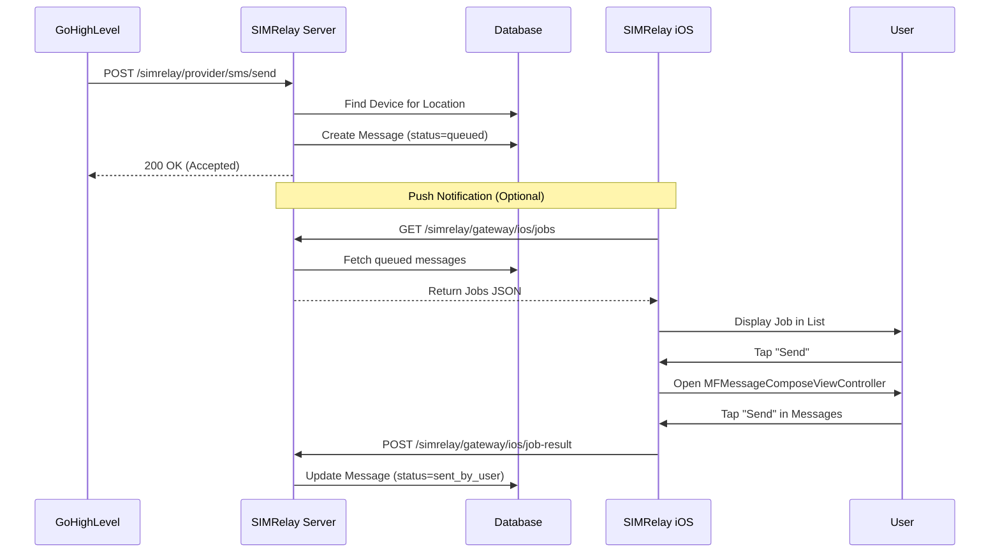
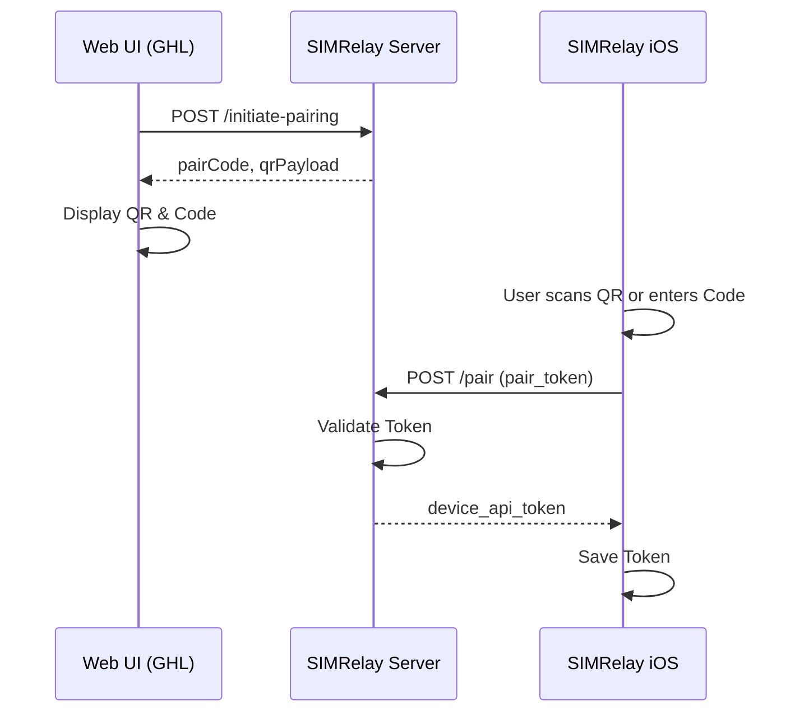

# SIMRelay Sequence Diagrams

## Outbound SMS Flow

```mermaid
sequenceDiagram
    participant GHL as GoHighLevel
    participant Server as SIMRelay Server
    participant DB as Database
    participant iOS as SIMRelay iOS
    participant User as User

    GHL->>Server: POST /simrelay/provider/sms/send
    Server->>DB: Find Device for Location
    Server->>DB: Create Message (status=queued)
    Server-->>GHL: 200 OK (Accepted)
    
    Note over Server, iOS: Push Notification (Optional)
    
    iOS->>Server: GET /simrelay/gateway/ios/jobs
    Server->>DB: Fetch queued messages
    Server-->>iOS: Return Jobs JSON
    
    iOS->>User: Display Job in List
    User->>iOS: Tap "Send"
    iOS->>User: Open MFMessageComposeViewController
    User->>iOS: Tap "Send" in Messages
    
    iOS->>Server: POST /simrelay/gateway/ios/job-result
    Server->>DB: Update Message (status=sent_by_user)
```

## Pairing Flow

```mermaid
sequenceDiagram
    participant Web as Web UI (GHL)
    participant Server as SIMRelay Server
    participant iOS as SIMRelay iOS
    
    Web->>Server: POST /initiate-pairing
    Server-->>Web: pairCode, qrPayload
    Web->>Web: Display QR & Code
    
    iOS->>iOS: User scans QR or enters Code
    iOS->>Server: POST /pair (pair_token)
    Server->>Server: Validate Token
    Server-->>iOS: device_api_token
    iOS->>iOS: Save Token
```
