# Self-Improving Agent: The Learning Engine

> **Goal**: Allow the AI agent to improve its skills, classifiers, and response quality from real conversations — without touching code.

## The Problem Today

Your current agent pipeline is **static**:

| Component | Storage | How to improve |
|---|---|---|
| Intent Classifier | `classifier.ts` + `intents.ts` | Edit code, redeploy |
| Skills | `lib/ai/skills/*/SKILL.md` files | Edit filesystem, redeploy |
| Policy Rules | `policy.ts` hardcoded array | Edit code, redeploy |
| Playbook / Rebuttals | `PlaybookEntry` model (unused) | — |
| Memory | `Insight` model (per-contact) | Works, but per-contact only |

Every new scenario (new objection type, new lead source pattern, new qualification question) requires a developer to modify files and redeploy. This doesn't scale.

## Industry Best Practices (2025-2026)

The SOTA approach combines three patterns:

1. **Dynamic Configuration** — Move hardcoded rules to database, make them editable via UI
2. **Knowledge Distillation** — AI analyzes real conversations → extracts patterns → stores them as reusable knowledge
3. **Meta-Agent Architecture** — A specialized "Learning Agent" that understands the full pipeline and proposes improvements

---

## Proposed Architecture: 3-Layer Learning Engine

```mermaid
graph TB
    subgraph "Layer 1: Knowledge Extraction"
        A["🔍 Conversation Analyzer"] --> B["Extract Patterns"]
        B --> C["Identify Gaps"]
        C --> D["Generate Proposals"]
    end

    subgraph "Layer 2: Dynamic Configuration (DB-Backed)"
        E["Intent Registry"]
        F["Skill Playbook"]
        G["Response Templates"]
        H["Policy Rules"]
        I["Few-Shot Examples"]
    end

    subgraph "Layer 3: Runtime Agent"
        J["Orchestrator"] --> K["Dynamic Classifier"]
        K --> L["Skill Executor + Playbook"]
        L --> M["Policy + Reflexion"]
    end

    D -->|"Proposes"| E
    D -->|"Proposes"| F
    D -->|"Proposes"| G
    
    E -->|"Feeds"| K
    F -->|"Feeds"| L
    G -->|"Feeds"| L
    H -->|"Feeds"| M
    I -->|"Feeds"| K
```



---

## Detailed Design

### Layer 1: The Learning Agent (Conversation Analyzer)

A **Meta-Agent** that you trigger from the UI. It:

1. **Reads** the full conversation transcript (or phone call transcript you paste)
2. **Understands** the current pipeline (fed as context: available intents, skills, policies)
3. **Identifies gaps** — "This conversation contained a scenario not covered by any intent" or "The agent missed an opportunity to cross-sell"
4. **Proposes improvements** as structured data:
   - New intent definitions
   - New playbook entries (response strategies, rebuttals)
   - New few-shot examples for the classifier
   - Policy rule suggestions
   - Skill instruction amendments

The key insight: **the Learning Agent doesn't modify code — it writes to the DB**, and the runtime agent reads from the DB.

#### UI Flow

```
┌─────────────────────────────────────────────┐
│  Mission Control Panel                       │
│                                              │
│  [🧠 Orchestrate]  [📚 Learn from This]     │
│                                              │
│  ┌──────────────────────────────────────┐    │
│  │ Learning Analysis                     │    │
│  │                                      │    │
│  │ ✅ Intent Coverage: 3/4 messages OK  │    │
│  │ ⚠️  Gap Found: "REFERRAL" intent     │    │
│  │    missing — client referred a friend │    │
│  │                                      │    │
│  │ Proposals:                           │    │
│  │ ┌────────────────────────────────┐   │    │
│  │ │ + Add REFERRAL intent          │   │    │
│  │ │   Risk: low, Skill: qualifier  │   │    │
│  │ │   [✅ Apply] [❌ Dismiss]       │   │    │
│  │ └────────────────────────────────┘   │    │
│  │ ┌────────────────────────────────┐   │    │
│  │ │ + Playbook: "Referral Thank    │   │    │
│  │ │   You" response template       │   │    │
│  │ │   [✅ Apply] [❌ Dismiss]       │   │    │
│  │ └────────────────────────────────┘   │    │
│  └──────────────────────────────────────┘    │
└─────────────────────────────────────────────┘
```

### Layer 2: Dynamic Configuration (DB-Backed)

Move configuration from files to the database so the Learning Agent can write to it and the runtime agent reads from it.

#### New Database Models

```prisma
// Dynamic intent definitions (supplements static intents.ts)
model DynamicIntent {
  id          String   @id @default(cuid())
  name        String   @unique  // e.g. "REFERRAL"
  description String   @db.Text // When to classify as this
  risk        String   @default("medium") // low, medium, high
  skillName   String?  // Which skill handles this
  effort      String   @default("standard") // flash, standard, premium
  examples    Json?    // Few-shot examples: [{ message, expectedIntent }]
  isActive    Boolean  @default(true)
  source      String   @default("learning_agent") // learning_agent, manual
  createdAt   DateTime @default(now())
  updatedAt   DateTime @updatedAt
  
  @@map("dynamic_intents")
}

// Playbook entries (response strategies, rebuttals, templates)
// Already exists as PlaybookEntry — we expand it
model PlaybookEntry {
  id          String   @id @default(cuid())
  text        String   @db.Text  // The actual content/template
  category    String   // "rebuttal", "template", "strategy", "example"
  subcategory String?  // "price_objection", "referral_thankyou", etc.
  intent      String?  // Which intent this applies to
  skillName   String?  // Which skill should use this
  priority    Int      @default(5) // 1-10, higher = more relevant
  isActive    Boolean  @default(true)
  source      String   @default("learning_agent")
  metadata    Json?    // Additional structured data
  createdAt   DateTime @default(now())
  updatedAt   DateTime @updatedAt
  
  @@index([category])
  @@index([intent])
  @@index([skillName])
  @@map("playbook_entries")
}

// Learning session records
model LearningSession {
  id               String   @id @default(cuid())
  conversationId   String?
  inputType        String   // "conversation", "transcript", "manual"
  inputText        String?  @db.Text // Raw transcript if pasted
  analysis         Json     // Full analysis output
  proposalsCount   Int      @default(0)
  appliedCount     Int      @default(0)
  status           String   @default("pending") // pending, reviewed, applied
  createdAt        DateTime @default(now())
  
  proposals        LearningProposal[]
  
  @@map("learning_sessions")
}

model LearningProposal {
  id          String   @id @default(cuid())
  sessionId   String
  type        String   // "new_intent", "playbook_entry", "policy_rule", "skill_amendment", "few_shot_example"
  title       String
  description String   @db.Text
  payload     Json     // The structured data to apply
  status      String   @default("pending") // pending, approved, rejected, applied
  appliedAt   DateTime?
  createdAt   DateTime @default(now())
  
  session     LearningSession @relation(fields: [sessionId], references: [id], onDelete: Cascade)
  
  @@index([sessionId])
  @@map("learning_proposals")
}
```

### Layer 3: Runtime Integration

The orchestrator and classifier are modified to read dynamic configuration alongside static:

#### Classifier Enhancement

```diff
// classifier.ts changes
+ import { getDynamicIntents } from "./dynamic-config";

  const CLASSIFIER_PROMPT = `You are an intent classifier...
  ${Object.keys(INTENTS).join(", ")}
+ ${dynamicIntents.map(i => i.name).join(", ")}

+ // Include few-shot examples from dynamic intents
+ ${dynamicIntents
+   .filter(i => i.examples)
+   .flatMap(i => i.examples.map(ex => `"${ex.message}" → ${i.name}`))
+   .join("\n")}
```

#### Skill Execution Enhancement

```diff
// loader.ts changes — executeSkill()
+ // Inject relevant playbook entries into the skill prompt
+ const playbookEntries = await getPlaybookForSkill(skill.name, context.intent);

  const systemPrompt = `${skill.instructions}
+ ## Sales Playbook (Dynamic Knowledge)
+ ${playbookEntries.map(p => `### ${p.subcategory}\n${p.text}`).join("\n\n")}
```

---

## User Review Required

> [!IMPORTANT]
> **Architecture Decision: DB-backed vs File-backed dynamic config**
> This plan proposes storing dynamic intents and playbook entries in the **database**. This means the Learning Agent writes to PostgreSQL, and the runtime agent reads from it. The alternative is writing to files (like the current `SKILL.md` approach), but that requires filesystem access and redeploys. **DB-backed is recommended** for instant updates without deployment.

> [!WARNING]
> **Scope**: This is a large feature. The plan is broken into 3 phases. Phase 1 (DB schema + Learning Agent backend) is the foundation. Phase 2 (UI) makes it usable. Phase 3 (auto-learning) makes it powerful. I recommend implementing **Phase 1 + Phase 2** first and testing before Phase 3.

---

## Proposed Changes

### Phase 1: Foundation (DB + Learning Agent Backend)

---

#### Database Schema

##### [MODIFY] [schema.prisma](file:///Users/martingreen/Projects/IDX/prisma/schema.prisma)
- Expand `PlaybookEntry` model with `subcategory`, `intent`, `skillName`, `priority`, `isActive`, `source`, `metadata`, `updatedAt` fields
- Add `DynamicIntent` model
- Add `LearningSession` model
- Add `LearningProposal` model

---

#### Dynamic Configuration Layer

##### [NEW] [dynamic-config.ts](file:///Users/martingreen/Projects/IDX/lib/ai/dynamic-config.ts)
New module that provides runtime access to dynamic intents and playbook entries:
- `getDynamicIntents()` — Returns all active `DynamicIntent` records
- `getPlaybookForSkill(skillName, intent)` — Returns relevant playbook entries for a skill execution
- `getPlaybookForIntent(intent)` — Returns playbook entries matching an intent
- `addDynamicIntent(data)` — Creates a new dynamic intent
- `addPlaybookEntry(data)` — Creates a new playbook entry

---

#### Learning Agent

##### [NEW] [learning-agent.ts](file:///Users/martingreen/Projects/IDX/lib/ai/learning-agent.ts)
The Meta-Agent that analyzes conversations and proposes improvements:
- `analyzeConversation(conversationId)` — Reads full conversation, runs gap analysis
- `analyzeTranscript(text)` — Analyzes pasted text (phone call transcript, etc.)
- Uses Gemini Pro/Thinking model with a comprehensive system prompt that includes:
  - Current intent registry (static + dynamic)
  - Current skill list with descriptions
  - Current policy rules summary
  - Current playbook entries
- Returns structured `LearningProposal[]`

---

#### Classifier Integration

##### [MODIFY] [classifier.ts](file:///Users/martingreen/Projects/IDX/lib/ai/classifier.ts)
- Fetch dynamic intents at classification time
- Inject dynamic intent names and few-shot examples into the classifier prompt
- Fall back to static `INTENTS` map if dynamic lookup fails

##### [MODIFY] [intents.ts](file:///Users/martingreen/Projects/IDX/lib/ai/intents.ts)
- Add `mergeWithDynamic(dynamicIntents)` helper that combines static intents with DB-backed ones

---

#### Skill Execution Integration

##### [MODIFY] [loader.ts](file:///Users/martingreen/Projects/IDX/lib/ai/skills/loader.ts)
- In `executeSkill()`, fetch relevant playbook entries and inject into the skill's system prompt
- Playbook entries act as dynamic knowledge that supplements the static `SKILL.md` instructions

---

### Phase 2: UI (Coordinator Panel + Learning UI)

---

#### Server Actions

##### [MODIFY] [actions.ts](file:///Users/martingreen/Projects/IDX/app/(main)/admin/conversations/actions.ts)
- Add `analyzeConversationAction(conversationId)` — Triggers the Learning Agent
- Add `analyzeTranscriptAction(text)` — Analyzes pasted transcript
- Add `applyProposalAction(proposalId)` — Applies a single proposal
- Add `dismissProposalAction(proposalId)` — Rejects a proposal
- Add `getLearningSessionsAction(conversationId?)` — Fetches learning history

---

#### UI Components

##### [MODIFY] [coordinator-panel.tsx](file:///Users/martingreen/Projects/IDX/app/(main)/admin/conversations/_components/coordinator-panel.tsx)
- Add "📚 Learn from This" button next to the existing "🧠 Orchestrate" button
- Add learning results display section showing:
  - Coverage analysis (which messages were handled well, which weren't)
  - Gap identification
  - Proposal cards with Apply/Dismiss buttons
- Add "Paste Transcript" option for phone call analysis

##### [NEW] [learning-results.tsx](file:///Users/martingreen/Projects/IDX/app/(main)/admin/conversations/_components/learning-results.tsx)
Dedicated component for rendering learning analysis results:
- Proposal cards with type badges (intent, playbook, policy)
- Apply/Dismiss/Edit workflow per proposal
- Before/After preview showing how the agent would handle the conversation differently

---

### Phase 3: Auto-Learning (Future Enhancement)

> [!NOTE]
> Phase 3 is a future enhancement after Phase 1+2 are validated.

- **Feedback Loop**: When a user edits a draft before sending, auto-trigger learning to understand "why the draft needed editing"
- **Batch Learning**: Weekly cron job that analyzes all conversations from the past week, identifies recurring patterns, and proposes batch improvements
- **A/B Testing**: Dynamic intents and playbook entries can be marked as "experimental" and tested against baseline performance

---

## How It All Connects


## Verification Plan

### Automated Tests
- No existing test suite was found for the AI pipeline. The verification will be through manual testing.

### Manual Verification
1. **Phase 1 verification**: After schema migration and backend implementation:
   - Create a test conversation with a "referral" scenario (not currently handled)
   - Trigger the Learning Agent via a test action
   - Verify it produces a `REFERRAL` intent proposal and a playbook entry
   - Apply the proposals via the action
   - Run the classifier on the same message — verify it now returns `REFERRAL`

2. **Phase 2 verification**: After UI implementation:
   - Open a conversation in the UI
   - Click "Learn from This"
   - Verify proposals render correctly with Apply/Dismiss buttons
   - Apply a proposal and verify it appears in the DB
   - Test the orchestrator on a new message — verify the dynamic knowledge is used

3. **User testing**: The user should verify:
   - Paste a phone call transcript and trigger analysis
   - Review proposals for accuracy and relevance
   - Apply proposals and test the agent on similar future messages
