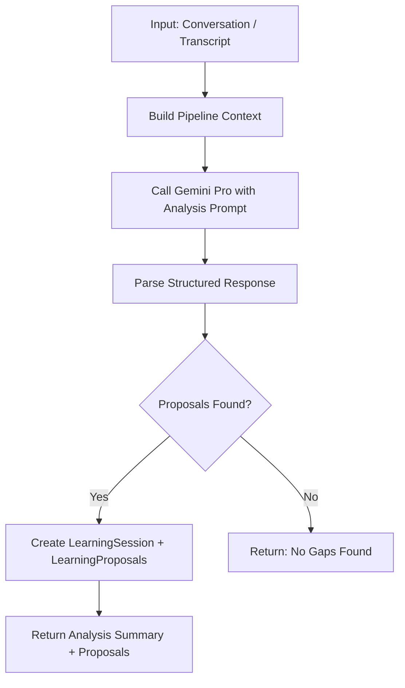

# Phase 1: Foundation — DB Schema + Learning Agent Backend

> Part of the [Learning Engine](./07-learning-engine.md) architecture.
> **Status**: Planned

## Overview

Phase 1 establishes the database layer for dynamic configuration and implements the Learning Agent backend. After this phase, the system can analyze conversations and store proposals — but has no UI yet.

---

## 1. Database Schema Changes

### 1.1 Expand `PlaybookEntry` Model

The existing `PlaybookEntry` model in `schema.prisma` is currently minimal:

```prisma
model PlaybookEntry {
  id         String   @id @default(cuid())
  text       String   @db.Text
  category   String
  createdAt  DateTime @default(now())
  @@map("playbook_entries")
}
```

**Expand to:**

```prisma
model PlaybookEntry {
  id          String   @id @default(cuid())
  text        String   @db.Text       // The actual content/template/strategy
  category    String                   // "rebuttal", "template", "strategy", "example", "guideline"
  subcategory String?                  // "price_objection", "referral_thankyou", etc.
  intent      String?                  // Which intent this applies to (e.g. "OBJECTION", "REFERRAL")
  skillName   String?                  // Which skill should use this (e.g. "lead_qualification")
  priority    Int      @default(5)     // 1-10, higher = more relevant
  isActive    Boolean  @default(true)
  source      String   @default("manual") // "learning_agent", "manual", "imported"
  metadata    Json?                    // Additional structured data
  createdAt   DateTime @default(now())
  updatedAt   DateTime @updatedAt

  @@index([category])
  @@index([intent])
  @@index([skillName])
  @@map("playbook_entries")
}
```

### 1.2 New: `DynamicIntent` Model

Supplements the static `intents.ts` with database-backed intent definitions:

```prisma
model DynamicIntent {
  id          String   @id @default(cuid())
  name        String   @unique        // e.g. "REFERRAL", "CROSS_SELL"
  description String   @db.Text       // Human-readable: when to classify as this
  risk        String   @default("medium") // low, medium, high
  skillName   String?                  // Which skill handles this intent
  effort      String   @default("standard") // flash, standard, premium
  examples    Json?                    // Few-shot: [{ message: "...", expectedIntent: "REFERRAL" }]
  isActive    Boolean  @default(true)
  source      String   @default("learning_agent") // learning_agent, manual
  createdAt   DateTime @default(now())
  updatedAt   DateTime @updatedAt

  @@map("dynamic_intents")
}
```

### 1.3 New: `LearningSession` + `LearningProposal` Models

Track analysis sessions and their individual proposals:

```prisma
model LearningSession {
  id               String   @id @default(cuid())
  conversationId   String?
  inputType        String   // "conversation", "transcript", "manual"
  inputText        String?  @db.Text  // Raw transcript if pasted
  analysis         Json                // Full analysis output from Learning Agent
  proposalsCount   Int      @default(0)
  appliedCount     Int      @default(0)
  status           String   @default("pending") // pending, reviewed, applied, dismissed
  createdAt        DateTime @default(now())

  proposals        LearningProposal[]

  @@map("learning_sessions")
}

model LearningProposal {
  id          String    @id @default(cuid())
  sessionId   String
  type        String    // "new_intent", "playbook_entry", "policy_rule", "skill_amendment", "few_shot_example"
  title       String    // Human-readable proposal title
  description String    @db.Text  // What and why
  payload     Json      // The structured data to apply (the actual DynamicIntent or PlaybookEntry data)
  status      String    @default("pending") // pending, approved, rejected, applied
  appliedAt   DateTime?
  createdAt   DateTime  @default(now())

  session     LearningSession @relation(fields: [sessionId], references: [id], onDelete: Cascade)

  @@index([sessionId])
  @@map("learning_proposals")
}
```

---

## 2. Dynamic Configuration Module

### File: `lib/ai/dynamic-config.ts`

Provides runtime access to DB-backed configuration:

```typescript
// Core functions:

// Intents
getDynamicIntents(): Promise<DynamicIntent[]>
addDynamicIntent(data): Promise<DynamicIntent>
toggleDynamicIntent(id, active): Promise<void>

// Playbook
getPlaybookForSkill(skillName, intent?): Promise<PlaybookEntry[]>
getPlaybookForIntent(intent): Promise<PlaybookEntry[]>
addPlaybookEntry(data): Promise<PlaybookEntry>

// Merged config (static + dynamic)
getMergedIntentMap(): Promise<Record<string, IntentConfig>>
```

**Key design decision:** Dynamic intents **supplement** static intents, they don't replace them. The `getMergedIntentMap()` function returns a combined map where dynamic intents can override static ones if the names match, but static intents remain the baseline.

---

## 3. Learning Agent

### File: `lib/ai/learning-agent.ts`

The Meta-Agent that understands the full pipeline and proposes improvements.

### System Prompt Strategy

The Learning Agent receives a comprehensive context prompt that includes:

1. **Current Intent Registry** — All static + dynamic intents with descriptions
2. **Current Skill List** — Name, description, and tool list for each skill
3. **Current Policy Rules** — Summary of all active policy checks
4. **Current Playbook** — All active playbook entries grouped by category
5. **The Conversation** — Full message history being analyzed

### Analysis Flow



### Output Format

The Learning Agent returns structured JSON:

```json
{
  "coverage_analysis": {
    "messages_analyzed": 8,
    "well_handled": 6,
    "gaps_found": 2,
    "gap_details": [
      { "message_index": 3, "message": "My friend is also looking...", "issue": "No REFERRAL intent exists" },
      { "message_index": 7, "message": "What about financing?", "issue": "lead_qualification skill lacks financing guidance" }
    ]
  },
  "proposals": [
    {
      "type": "new_intent",
      "title": "Add REFERRAL intent",
      "description": "Client referred a friend. No intent currently captures referral scenarios.",
      "payload": {
        "name": "REFERRAL",
        "description": "When a client mentions referring someone or introduces a new potential lead",
        "risk": "low",
        "skillName": "lead_qualification",
        "effort": "standard",
        "examples": [
          { "message": "My friend is also looking for a place", "expectedIntent": "REFERRAL" },
          { "message": "I told my colleague about you", "expectedIntent": "REFERRAL" }
        ]
      }
    },
    {
      "type": "playbook_entry",
      "title": "Financing question response template",
      "description": "Add a response strategy for handling financing questions during qualification",
      "payload": {
        "text": "When asked about financing: 1) Acknowledge interest 2) Explain available options (bank mortgage, developer installment, cash) 3) Offer to connect with a financial advisor partner 4) Note their financing preference as an insight",
        "category": "strategy",
        "subcategory": "financing_guidance",
        "intent": "QUALIFICATION",
        "skillName": "lead_qualification",
        "priority": 7
      }
    }
  ]
}
```

---

## 4. Classifier Integration

### Changes to `classifier.ts`

The classifier prompt is extended to include dynamic intents:

```typescript
export async function classifyIntent(message: string, context?: string) {
    // Fetch dynamic intents from DB
    const dynamicIntents = await getDynamicIntents();
    
    // Build combined intent list
    const allIntentNames = [
        ...Object.keys(INTENTS),
        ...dynamicIntents.map(i => i.name)
    ];
    
    // Build few-shot examples from dynamic intents
    const fewShotExamples = dynamicIntents
        .filter(i => i.examples && Array.isArray(i.examples))
        .flatMap(i => (i.examples as any[]).map(
            ex => `"${ex.message}" → ${i.name}`
        ));
    
    // Inject into prompt
    const prompt = `...
    Available intents: ${allIntentNames.join(", ")}
    
    ${fewShotExamples.length > 0 ? `Examples:\n${fewShotExamples.join("\n")}` : ""}
    ...`;
    
    // ... rest of classification logic
    
    // Look up intent config from merged map
    const mergedMap = await getMergedIntentMap();
    const intentConfig = mergedMap[intentName] ?? mergedMap.UNKNOWN;
    // ...
}
```

### Changes to `intents.ts`

Add a merge helper:

```typescript
export function mergeWithDynamic(dynamicIntents: DynamicIntent[]): Record<string, IntentConfig> {
    const merged = { ...INTENTS };
    for (const di of dynamicIntents) {
        merged[di.name] = {
            risk: di.risk as "low" | "medium" | "high",
            skill: di.skillName,
            effort: di.effort as "flash" | "standard" | "premium"
        };
    }
    return merged;
}
```

---

## 5. Skill Execution Integration

### Changes to `loader.ts` → `executeSkill()`

Inject playbook entries into the skill's system prompt:

```typescript
// In executeSkill(), before building systemPrompt:
const playbookEntries = await getPlaybookForSkill(skill.name, context.intent);

const systemPrompt = `${skill.instructions}

## Sales Playbook (Dynamic Knowledge)
${playbookEntries.length > 0 
    ? playbookEntries.map(p => `### ${p.subcategory || p.category}\n${p.text}`).join("\n\n")
    : "No playbook entries available for this context."
}

## Available Tools
...
`;
```

This means: every time a skill runs, it automatically picks up any new playbook entries that have been added via the Learning Agent. **No code changes needed.**

---

## 6. Proposal Application Logic

### File: `lib/ai/learning-agent.ts` (continued)

```typescript
export async function applyProposal(proposalId: string): Promise<{ success: boolean }> {
    const proposal = await db.learningProposal.findUnique({ where: { id: proposalId } });
    if (!proposal || proposal.status !== "pending") throw new Error("Invalid proposal");
    
    switch (proposal.type) {
        case "new_intent":
            await addDynamicIntent(proposal.payload as any);
            break;
        case "playbook_entry":
            await addPlaybookEntry(proposal.payload as any);
            break;
        case "few_shot_example":
            // Append examples to existing DynamicIntent
            await appendFewShotExamples(proposal.payload as any);
            break;
        // ... other types
    }
    
    await db.learningProposal.update({
        where: { id: proposalId },
        data: { status: "applied", appliedAt: new Date() }
    });
    
    // Update session counts
    await db.learningSession.update({
        where: { id: proposal.sessionId },
        data: { appliedCount: { increment: 1 } }
    });
    
    return { success: true };
}
```

---

## Verification

After implementing Phase 1:

1. Run `npx prisma db push` to apply schema changes
2. Create a test conversation with a novel scenario
3. Call `analyzeConversation()` directly and verify it returns proposals
4. Apply a proposal and verify the `DynamicIntent` / `PlaybookEntry` records are created
5. Run the classifier on a matching message — verify it picks up the new intent
6. Run a skill and verify it includes the new playbook entry in its prompt

---

## Files Changed

| Action | File |
|--------|------|
| MODIFY | `prisma/schema.prisma` |
| NEW | `lib/ai/dynamic-config.ts` |
| NEW | `lib/ai/learning-agent.ts` |
| MODIFY | `lib/ai/classifier.ts` |
| MODIFY | `lib/ai/intents.ts` |
| MODIFY | `lib/ai/skills/loader.ts` |
