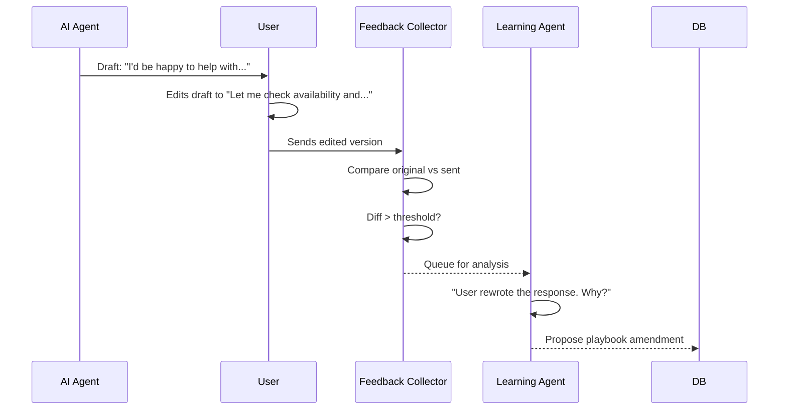
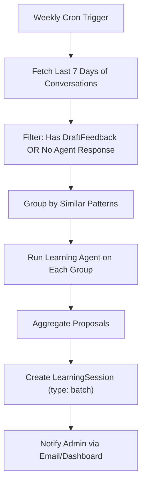

# Phase 3: Auto-Learning — Feedback Loops & Batch Intelligence

> Part of the [Learning Engine](./07-learning-engine.md) architecture.
> **Status**: Future Enhancement
> **Depends on**: [Phase 1](./07a-phase1-foundation.md) + [Phase 2](./07b-phase2-ui.md)

## Overview

Phase 3 makes the Learning Engine **proactive**. Instead of waiting for the user to click "Learn from This", the system automatically identifies learning opportunities and surfaces them. This is the transition from human-triggered learning to continuous, autonomous improvement.

---

## 1. Draft Edit Feedback Loop

### Concept

When a user **edits a draft** before sending, this is an implicit signal that the AI's response was imperfect. The system captures this feedback automatically and learns from it.

### Flow



### Implementation

#### New Table: `DraftFeedback`

```prisma
model DraftFeedback {
  id              String   @id @default(cuid())
  conversationId  String
  executionId     String?  // Link to AgentExecution that produced the draft
  originalDraft   String   @db.Text
  sentVersion     String   @db.Text
  diffSummary     String?  @db.Text  // AI-generated summary of what changed
  editDistance     Float?   // Normalized edit distance (0-1)
  analyzed        Boolean  @default(false)
  learningSessionId String?
  createdAt       DateTime @default(now())

  @@index([conversationId])
  @@index([analyzed])
  @@map("draft_feedback")
}
```

#### Detection Logic (in `sendReply` action)

```typescript
// In sendReply(), after successful send:
if (lastAgentExecution?.draftReply) {
    const editDistance = calculateNormalizedEditDistance(lastAgentExecution.draftReply, text);
    
    if (editDistance > 0.2) { // More than 20% different
        await db.draftFeedback.create({
            data: {
                conversationId,
                executionId: lastAgentExecution.id,
                originalDraft: lastAgentExecution.draftReply,
                sentVersion: text,
                editDistance,
            }
        });
    }
}
```

---

## 2. Batch Learning (Weekly Cron Job)

### Concept

A scheduled job runs weekly, analyzing all conversations from the past week to identify **recurring patterns** that the agent doesn't handle well.

### Flow



### Implementation

#### Cron Endpoint: `POST /api/cron/batch-learning`

```typescript
// Pseudocode
export async function POST() {
    // 1. Find conversations with unanalyzed feedback
    const feedbackItems = await db.draftFeedback.findMany({
        where: { analyzed: false },
        include: { conversation: true }
    });
    
    // 2. Find conversations where agent had no skill match
    const gapConversations = await db.agentExecution.findMany({
        where: {
            createdAt: { gte: sevenDaysAgo },
            draftReply: null,
            status: "success" // Ran but produced nothing
        }
    });
    
    // 3. Run Learning Agent on a summary of these
    const batchAnalysis = await analyzeBatch([...feedbackItems, ...gapConversations]);
    
    // 4. Create session and proposals
    // 5. Mark feedback as analyzed
    // 6. Send notification
}
```

### Notification

After batch analysis completes, send a summary to the admin:

```
Subject: 🧠 Weekly Learning Report — 3 Improvements Suggested

This week's analysis of 47 conversations found:
• 2 new intent patterns (REFERRAL, MAINTENANCE_REQUEST)
• 1 playbook update (financing guidance needs update)
• 5 draft edits analyzed (common theme: shorter responses preferred)

→ Review proposals in Mission Control
```

---

## 3. A/B Testing for Dynamic Config

### Concept

When a dynamic intent or playbook entry is marked as "experimental", the system tracks its performance against the baseline. After sufficient data, it can auto-promote or auto-demote entries.

### Implementation

#### `DynamicIntent` Extensions

```prisma
model DynamicIntent {
  // ... existing fields ...
  
  // A/B Testing
  isExperimental  Boolean  @default(false)
  hitCount        Int      @default(0)     // Times this intent was matched
  approvalRate    Float?                   // % of drafts sent without editing
  promotedAt      DateTime?               // When moved from experimental to active
}
```

#### Tracking Logic

```typescript
// In classifier, after matching a dynamic intent:
await db.dynamicIntent.update({
    where: { id: matchedIntent.id },
    data: { hitCount: { increment: 1 } }
});

// In feedback loop, when draft is sent unedited:
// Update approvalRate for the intent that was used
```

#### Auto-Promotion Threshold

```typescript
// In batch learning cron:
const experimentalIntents = await db.dynamicIntent.findMany({
    where: { isExperimental: true, hitCount: { gte: 10 } }
});

for (const intent of experimentalIntents) {
    if (intent.approvalRate >= 0.8) {
        // 80%+ approval rate with 10+ uses → promote
        await db.dynamicIntent.update({
            where: { id: intent.id },
            data: { isExperimental: false, promotedAt: new Date() }
        });
    } else if (intent.approvalRate < 0.3 && intent.hitCount >= 20) {
        // Very low approval with enough data → demote
        await db.dynamicIntent.update({
            where: { id: intent.id },
            data: { isActive: false }
        });
    }
}
```

---

## 4. Learning Dashboard (Admin Page)

### New Route: `/admin/ai/learning`

A dedicated page showing:

1. **Learning Health** — Overall coverage score, gap trends
2. **Active Dynamic Config** — All custom intents and playbook entries with hit counts
3. **Pending Proposals** — From batch analysis waiting for review
4. **Feedback Timeline** — Draft edits over time, showing agent accuracy improvement
5. **Experimental Items** — A/B test status for experimental intents

### Metrics to Track

| Metric | Description |
|--------|-------------|
| Intent Coverage | % of messages matched to a non-UNKNOWN intent |
| Draft Accuracy | % of drafts sent without editing |
| Learning Velocity | Proposals applied per week |
| Skill Utilization | Which skills are used most/least |
| Playbook Hit Rate | Which playbook entries are injected most |

---

## 5. Cross-Conversation Knowledge Transfer

### Concept

When the Learning Agent identifies a pattern in one conversation, it can check if similar patterns exist across other conversations, strengthening the confidence of its proposals.

```typescript
// In learning-agent.ts
async function enrichProposalWithCrossConversationData(proposal: LearningProposal) {
    // Search for similar messages across all conversations using vector similarity
    const similarMessages = await db.$queryRaw`
        SELECT m.body, c."contactName"
        FROM "Message" m
        JOIN "Conversation" c ON m."conversationId" = c.id
        WHERE m.direction = 'inbound'
        ORDER BY embedding <=> ${proposalEmbedding}::vector
        LIMIT 10
    `;
    
    // If 3+ similar messages found → increase proposal confidence
    proposal.confidence = similarMessages.length >= 3 ? "high" : "medium";
    proposal.supportingEvidence = similarMessages;
}
```

---

## Verification

Phase 3 verification is primarily behavioral and metric-based:

1. **Feedback Loop**: Edit a draft, send it, check that `DraftFeedback` record is created
2. **Batch Learning**: Manually trigger the cron endpoint, verify proposals are generated
3. **A/B Testing**: Create an experimental intent, use it 10+ times, verify auto-promotion
4. **Dashboard**: Navigate to `/admin/ai/learning`, verify all metrics render
5. **Long-term**: Over 2 weeks of use, verify that Intent Coverage and Draft Accuracy metrics trend upward

---

## Files Changed

| Action | File |
|--------|------|
| MODIFY | `prisma/schema.prisma` (DraftFeedback model, DynamicIntent A/B fields) |
| MODIFY | `app/(main)/admin/conversations/actions.ts` (feedback capture in sendReply) |
| NEW | `app/api/cron/batch-learning/route.ts` |
| NEW | `app/(main)/admin/ai/learning/page.tsx` |
| NEW | `lib/ai/learning-agent.ts` (batch analysis functions) |
