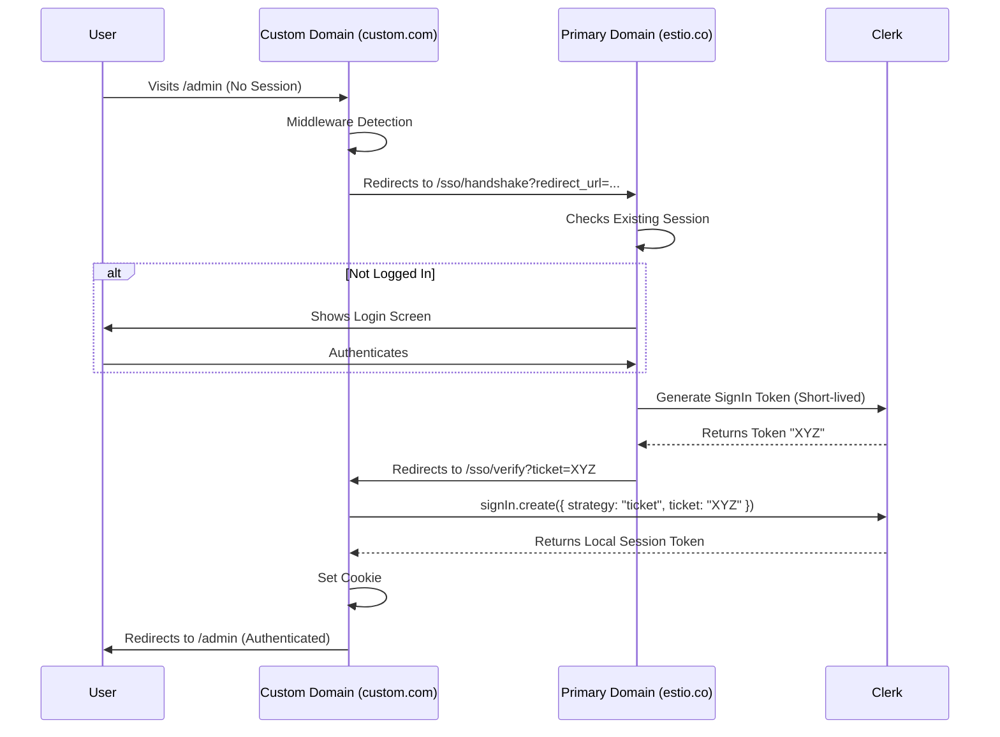

# Cross-Domain SSO for White Label Admin

> **Status:** ✅ Implemented
> **Architecture:** Manual Token Handshake
> **Goal:** Allow users to access the Admin Dashboard from their custom domain (`custom.com/admin`) while sharing the authenticated session from the primary domain (`estio.co`).
> **See also:** [multi-tenant-auth-email.md](./multi-tenant-auth-email.md) for complete auth & email setup


## The Problem
Cookies are domain-specific. A user logged into the primary domain (`estio.co`) is **not** recognized as logged in when they visit a white-labeled custom domain (`custom.com`), even though the backend code is the same.

## The Solution: Manual Handshake
We implemented a secure Ticket Exchange flow (similar to CAS or OAuth) to "teleport" the session.



## Implementation Details

### 1. Middleware (`middleware.ts`)
The middleware on the Custom Domain handles access control for system paths.

**For `/admin`** (Hybrid Model):
- **Signed-out users** → Redirect to tenant's `/sign-in?redirect_url=/admin`
- **Signed-in users** → Proceed to admin (role check happens server-side)
- **Public users** (signed-in but not admin) → Redirected to `/favorites` by admin page

**For `/setup` and other system paths**:
- Redirects to Primary Domain's SSO handshake endpoint
- **Exception**: It *skips* this check for `/sso/*` routes to avoid infinite redirect loops

### 2. Handshake Initiator (`app/sso/handshake/page.tsx`)
- Hosted on: **Primary Domain** (`estio.co`)
- Access: **Protected** (User must be logged in here first)
- Logic:
    1.  Validates the `redirect_url`.
    2.  Uses `clerkClient.signInTokens.createSignInToken()` to generate a secure, one-time use ticket associated with the current user.
    3.  Redirects back to the Custom Domain with `?ticket=...`.

### 3. Verification Handler (`app/sso/verify/page.tsx`)
- Hosted on: **Custom Domain** (`custom.com`)
- Access: **Public** (No session yet)
- Logic:
    1.  Extracts the `ticket` from the URL.
    2.  Calls the Client-side Clerk SDK: `signIn.create({ strategy: "ticket", ticket })`.
    3.  This establishes a **local** session cookie for `custom.com`.
    4.  Redirects the user to the final destination (e.g., `/admin`).

## Security Considerations
*   **Token Expiry**: Tickets expire in 60 seconds.
*   **One-Time Use**: Tickets can only be exchanged once.
*   **Same User**: The ticket is bound to the identity of the user on the primary domain.

## Clerk Configuration Requirements

> [!IMPORTANT]
> For SSO to work on custom domains, the domain must be whitelisted in **two separate** Clerk settings:

### 1. Allowed Origins (CORS)
Required for the Clerk Client SDK to function on the custom domain.
- **API**: `PATCH /v1/instance` with `allowed_origins` array
- **Dashboard**: Instance Settings → Security → Allowed Origins

### 2. Redirect URLs
Required for the `redirect_url` parameter in the handshake flow. Without this, the handshake will return:
```json
{"errors":[{"message":"is invalid","long_message":"https://custom-domain.com/ does not match one of the allowed values for parameter redirect_url"}]}
```
- **API**: `POST /v1/redirect_urls` with `{ url: "https://custom-domain.com/" }`
- **Dashboard**: Instance Settings → Security → Redirect URLs

### Automation
Both settings are **automatically handled** when a domain is saved in Site Settings via the `whitelistClerkDomain()` function in `lib/auth/clerk-domains.ts`.

For manual whitelisting, use:
```bash
export $(grep -v '^#' .env | xargs) && npx tsx scripts/manual-whitelist-domain.ts <domain>
```
