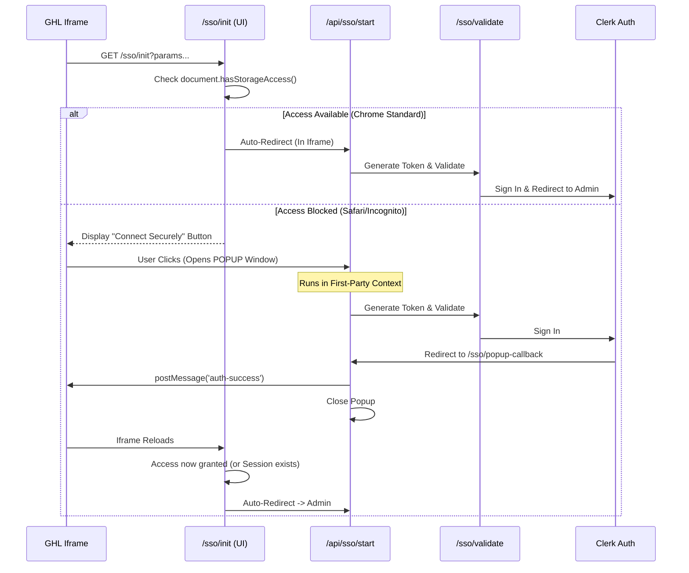

# GHL Custom Link SSO & Clerk Integration Flow

This document details the technical implementation of the GoHighLevel (GHL) Custom Menu Link Single Sign-On (SSO) and its integration with Clerk authentication.

**Recent Update (Dec 2025):** The flow now includes a **Popup Bridge** pattern to resolve third-party cookie blocking issues in modern browsers.

## Core Flow Architecture

The SSO process bridges the gap between GHL's iframe environment and our Clerk-authenticated application.

### 1. The Trigger (Custom Menu Link)

In GHL, the Custom Menu Link **MUST** be configured with these exact parameters:

```
URL: https://estio.co/sso/init?userId={{user.id}}&locationId={{location.id}}&userEmail={{user.email}}
Open in: iFrame (Inside platform)
```

### 2. The Chain of Events (Popup Bridge Pattern)

The system now uses a "Gatekeeper" UI to detect if the browser supports third-party cookies (Storage Access).



### 3. Detailed Step-by-Step

#### Step A: The Gatekeeper UI (`/sso/init`)
-   **Type**: Client-side React Page (`page.tsx`)
-   **Purpose**: Detects environment (Iframe vs Standard) and capabilities (Storage Access).
-   **Logic**:
    -   If standard window (not iframe): Redirects to API.
    -   If Iframe: **ALWAYS** shows "Connect Securely" UI to trigger Popup.
        -   *Update*: We no longer rely on `document.hasStorageAccess()` as it provided false positives. We force the popup flow in iframes to ensure 100% reliability for cookie setting.

#### Step B: The API Entry (`/api/sso/start`)
-   **Type**: Server-side API Route (`route.ts`)
-   **Purpose**: Securely captures GHL params and generates a signed internal JWT.
-   **Logic**:
    -   Accepts `userId`, `locationId`, `userEmail`.
    -   Constructs redirect URL using `NEXT_PUBLIC_APP_URL` (production) to avoid localhost issues behind proxies.
    -   Redirects to `/sso/validate`.

#### Step C: Validation (`/sso/validate`)
-   **Purpose**: The "Brain" of the operation.
-   **Logic**:
    1.  **Verifies Token**: Ensures request origin.
    2.  **Location/Role Check**: Verifies GHL data against DB and GHL API.
    3.  **User Sync**: Upserts `User` and links to `Location`.
    4.  **Role Assignment**: Creates `UserLocationRole` with `ADMIN` role (users who OAuth are auto-promoted to admin).
    5.  **Handover**: Calls `/api/clerk/sign-in-with-token`.
    6.  **Redirect**: Goes to `/admin` or the `redirect_url` (if one was passed, e.g., for the popup callback).

> [!NOTE]
> **Auto-Admin on OAuth (Dec 2025)**: When a user authorizes a GHL location, they are automatically assigned the `ADMIN` role for that location in the `UserLocationRole` table. This allows them to manage team members via `/admin/team`.

#### Step D: Clerk Authentication (`/api/clerk/sign-in-with-token`)
-   **Logic**:
    -   Generates a Clerk Sign-In Ticket via Clerk Backend API.
    -   Redirects user to `/sign-in` page with `__clerk_ticket` query param.

#### Step E: Manual Ticket Redemption (`/sign-in`)
-   **Logic**:
    -   The Sign-In page detects `__clerk_ticket`.
    -   Manually calls `signIn.create({ strategy: "ticket", ticket })` to redeem it.
    -   This explicit handling is required because the default Clerk component may not auto-detect tickets in some iframe/popup contexts.

#### Step F: Popup Callback (`/sso/popup-callback`)
-   **Purpose**: Final step of the Popup flow.
-   **Logic**: Sends `window.opener.postMessage('auth-success')` to the iframe and closes the popup.

---

## ⚠️ Starter Plan Limitations & Domain Switching

### The Behavior
On the **Starter Plan ($97)**, you CANNOT white-label the OAuth domain (`app.leadconnectorhq.com`).

1.  **Installation (OAuth)**:
    -   When a user first installs the app, they are redirected to `leadconnectorhq.com` to grant permissions.
    -   **Result**: The domain in the address bar (or iframe parent) momentarily changes.
    -   **Fix**: None (Limit of the plan).

2.  **Daily Use (SSO)**:
    -   Once installed, the SSO flow happens **entirely on your domain** (`estio.co` or `localhost`).
    -   **NO domain switching** occurs during normal daily use.

---

## Troubleshooting "Page Not Loading" / Redirect Loops

### 1. "Redirected too many times" (Cookie Block)
**Symptom**: Infinite loading loop or browser error.
**Cause**: Browser (Safari, Incognito) blocks third-party cookies inside the GHL iframe.
**Solution**:
-   **User**: Use the "Connect Securely" button if presented.
-   **Config**: Ensure Clerk is in Production mode.
-   **Workaround**: Change Custom Menu Link settings in GHL to **"Open in New Tab"** (Bypasses iframe issues entirely).

### 2. "Configuration Error"
**Symptom**: "Missing Parameters" screen.
**Fix**: Verify GHL Custom Link URL matches the required pattern exactly.

### 3. "Access Denied"
**Cause**: User is not an Admin or lacks permissions.
**Fix**: Check `ALLOWED_GHL_ROLES` in `.env`.

### 4. "Connection Expired"
**Symptom**: User sees a screen saying "Connection Expired" with a "Reconnect Now" button.
**Cause**: The GHL Access/Refresh tokens in the database are invalid, missing, or expired and could not be refreshed (e.g., if manually deleted).
**Solution**: Click **"Reconnect Now"**. This will launch the OAuth flow (typically in a popup to avoid iframe blocks) to restore access/tokens.

---

## Deployment Notes

> [!IMPORTANT]
> **Conflict Warning**: When deploying, you cannot have both `init/page.tsx` and `init/route.ts` on the server.
> Next.js will crash with a build error.
> **Fix**: Ensure `app/(main)/sso/init/route.ts` is DELETED from the server before/during deployment if replacing it with the Gatekeeper Page.

## Debugging Commands

**Tail Logs:**
```bash
pm2 logs estio-app
```

**Verify DB State:**
```sql
SELECT id, "ghlLocationId", "lastSsoValidation" FROM "Location";
```
