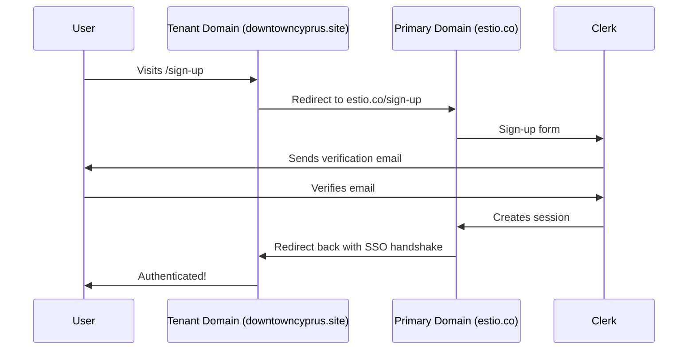

# Multi-Tenant Authentication & Email Delivery

> **Updated**: December 29, 2025
> **Status**: ✅ Implemented
> **Current Mode**: 🔧 **DEVELOPMENT** (using `pk_test`/`sk_test` Clerk keys)
> **Related Docs**: [cross-domain-sso.md](./cross-domain-sso.md), [saas-custom-domains-with-caddy.md](./saas-custom-domains-with-caddy.md), [deployment-scripts.md](./deployment-scripts.md)

This document covers the complete authentication and email delivery setup for tenant/satellite domains.

> [!NOTE]
> **Why Development Mode?** Clerk's Satellite Mode and `app:domains` API are **free** in Development mode but require **Clerk Pro Plan** in Production. We use dev keys until revenue-ready.
> See [deployment-scripts.md](./deployment-scripts.md) for instructions on switching to production.

---

## Overview

The application supports multi-tenant custom domains (e.g., `downtowncyprus.site`) that need to:
1. Authenticate users via Clerk
2. Redirect back to the tenant domain after authentication
3. Send verification emails

## Architecture



## 1. User Types & Distinctions

To avoid confusion between "Admins" and "Public Users", we define them as follows:

| Type | Definition | Data Model | Access |
|------|------------|------------|--------|
| **Team Member** (Admin/Member) | An employee or agent managing a Location. | `User` + `UserLocationRole` | `/admin/*` |
| **Public User** (Lead) | A website visitor saving properties or searches. | `Contact` Only (No `User` record) | `/favorites`, `/profile` |

> [!IMPORTANT]
> **Strict Separation**: To prevent duplicate data and ensure security:
> - **Tenant Sign-Ups** (Leads) create a `Contact` record but **SKIP** creating a `User` record. They are pure CRM entities.
> - **Team Invites** & **Platform Sign-Ups** create a `User` record.
>
> **Sign-In Forms**: The sign-in form is **visually identical** (Clerk Component). The difference is the metadata passed during sign-up:
> - **Tenant Domain**: Sends `locationId` (unsafe_metadata) -> Webhook creates `Contact`.
> - **Team Invite**: Sends `source: team_invite` and `locationId` (public_metadata) -> Webhook creates `User`, links to `Location`, and assigns `Role`.
> - **Platform Sign-Up**: Sends `source: platform` (implied) -> Webhook creates `User`.

---

## 2. Clerk Domain Whitelisting

Clerk requires custom domains to be whitelisted in **two separate** settings:

### 1.1 Allowed Origins (CORS)
Required for the Clerk Client SDK to function on the custom domain.

### 1.2 Redirect URLs
Required for the `redirect_url` parameter in auth flows. Without this, users see:
```json
{"errors":[{"message":"is invalid","long_message":"https://domain.com/ does not match one of the allowed values for parameter redirect_url"}]}
```

### Automation
Both are handled automatically when a domain is saved in Site Settings via:
- **File**: `lib/auth/clerk-domains.ts`
- **Functions**: `whitelistClerkDomain()` and `whitelistClerkRedirectUrl()`

### Manual Whitelisting
```bash
export $(grep -v '^#' .env | xargs) && npx tsx scripts/manual-whitelist-domain.ts <domain>
```

---

## 2. Satellite Domain Authentication (Lazy Satellite Mode) ✅

> **Updated**: December 29, 2025
> **Status**: ✅ Working
> **Architecture**: Hybrid / Lazy Satellite

### User Experience Requirements (Invariant)
These requirements are **non-negotiable** for the application's user experience:
1.  **Direct Tenant Sign-In**: Public users must sign in directly on the tenant domain (e.g., `downtowncyprus.site/sign-in`). Redirecting users to the platform domain (`estio.co`) for sign-in is **NOT ACCEPTABLE**.
2.  **No Anonymous Redirects**: Public visitors browsing the site must have a seamless experience. Automatic redirect loops to check for cross-domain sessions (standard Clerk Satellite behavior) are **FORBIDDEN** for anonymous users.
3.  **Local Feel**: The authentication experience must feel native to the tenant brand.

### The Solution: Lazy Satellite Mode
To satisfy these requirements while using Clerk (especially with Development Keys), we implemented a "Lazy" Satellite Mode.

#### How it Works
1.  **Default State (Anonymous)**:
    -   `isSatellite` is **DISABLED**.
    -   Clerk treats the site as a standalone public site.
    -   **Result**: No redirect loops. Fast loading.

2.  **Trigger State (Authenticated/Intent)**:
    -   `isSatellite` is **ENABLED** dynamically.
    -   Triggered ONLY when:
        -   User visits `/sign-in` or `/sign-up` (Auth Intent).
        -   User visits `/admin` or `/favorites` (Protected Routes).
        -   User has a `__session` cookie (Already Logged In).
        -   User returns from auth with a ticket (Handshake).

#### Implementation Details

1.  **Middleware detection** (`middleware.ts`):
    -   Inspects the path and cookies.
    -   If a trigger condition is met, sets a request header: `x-enable-satellite: true`.

2.  **Layout Consumption** (`app/(public-site)/[domain]/layout.tsx`):
    -   Reads the `x-enable-satellite` header.
    -   If true, sets `isSatellite={true}` and configures the domain.
    -   If false, `isSatellite` is omitted.

3.  **Relative URLs**:
    -   `signInUrl` and `signUpUrl` are set to relative paths (`/sign-in`, `/sign-up`).
    -   This ensures the "Sign In" button keeps the user on the tenant domain vs redirecting to Estio.

### Dev vs Production Strategy

| Environment | Keys | Clerk Features |
|-------------|------|----------------|
| **Development** | `pk_test`, `sk_test` | Full access to `app:domains`, Satellite Mode (free) |
| **Production** | `pk_live`, `sk_live` | Requires **Clerk Pro Plan** for Satellite Mode |

> [!WARNING]
> **Switch to Production Keys only when upgrading to Clerk Pro (Revenue Readiness).** See comments in `deploy-direct.sh`.

### Key Files


### 2.1 Centralized Configuration (`lib/app-config.ts`)
To prevent domain mismatches and hardcoding errors, all domain logic is centralized:

| Constant | Source | Description |
|---|---|---|
| `APP_DOMAIN` | `NEXT_PUBLIC_APP_DOMAIN` | The main production domain (e.g., `estio.co`) |
| `APP_URL` | `NEXT_PUBLIC_APP_URL` | Full base URL (e.g., `https://estio.co`) |
| `SYSTEM_DOMAINS` | (Computed) | List of domains served directly (not satellites), including `localhost` and `APP_DOMAIN`. |

### 2.2 Satellite Domain Authentication (Revised Strategy)
> **Updated**: January 2026
> **Status**: ✅ Fixed & Stable

#### The "Dev Keys in Production" Challenge
When using Clerk Development Keys (`pk_test_...`) on a production domain (`estio.co`), Clerk treats the production domain as a "Satellite" relative to the Development Instance's Hosted Account Portal (`...accounts.dev`).

**Previous Issue (Redirect Loop):**
We treated `estio.co` as "Primary" in `auth-wrapper.tsx` (`isSatellite=false`) but the Clerk SDK detected a mismatch with the keys and tried to handshake, causing an infinite loop.

**The Fix: Domain Alignment**
1.  **Aligned Configuration**: logic in `lib/auth/clerk-config.ts` now reads `NEXT_PUBLIC_CLERK_DOMAIN` (e.g., `magnetic-squirrel-16.accounts.dev`).
2.  **Explicit Satellite Mode**: `estio.co` is explicitly configured as a Satellite (`NEXT_PUBLIC_CLERK_IS_SATELLITE=true`) when running with Dev Keys.
3.  **Sign-In URL**: Points to the **Hosted Account Portal** (`https://magnetic-squirrel-16.accounts.dev/sign-in`) to perform the handshake correctly.

#### Implementation Details
*   `deploy-direct.sh`: Sets `NEXT_PUBLIC_CLERK_DOMAIN` and `NEXT_PUBLIC_CLERK_SIGN_IN_URL` to the Hosted Portal.
*   `auth-wrapper.tsx`: Uses `isSatellite={true}` (via env var).
*   `middleware.ts`: Uses `SYSTEM_DOMAINS` from `lib/app-config.ts` to identify the main site and avoid unnecessary rewrites.

---


## 3. Email Delivery (AWS SES)

### Configuration
| Setting | Value |
|---------|-------|
| Region | eu-central-1 (Frankfurt) |
| Domain | estio.co |
| SMTP Server | email-smtp.eu-central-1.amazonaws.com |
| Port | 587 (STARTTLS) or 465 (TLS) |

### DNS Records Required

#### Domain Verification (TXT)
| Host | Value |
|------|-------|
| `_amazonses` | `eXQ9RppMncxJ1rdT00EqW22+BzBpyM6FU7Xr7euesT8=` |

#### DKIM Records (CNAME)
| Host | Value |
|------|-------|
| `wdrj56tgjthhyqkbrsndxxmnlgdsja7s._domainkey` | `wdrj56tgjthhyqkbrsndxxmnlgdsja7s.dkim.amazonses.com` |
| `cdkdidbiipwgpx2sn6tgg4leqbk4x4va._domainkey` | `cdkdidbiipwgpx2sn6tgg4leqbk4x4va.dkim.amazonses.com` |
| `rdeefzngbqzr2fqmjz2zzzcfc7bemmcm._domainkey` | `rdeefzngbqzr2fqmjz2zzzcfc7bemmcm.dkim.amazonses.com` |

#### DMARC Record (TXT)
| Host | Value |
|------|-------|
| `_dmarc` | `v=DMARC1; p=none; rua=mailto:dmarc@estio.co; adkim=s; aspf=s; pct=100` |

### Clerk Email Integration
Clerk uses SendGrid by default. To use custom SMTP (AWS SES):
1. Disable "Delivered by Clerk" for email templates
2. Listen to the `emails` webhook
3. Send emails via AWS SES in your webhook handler

---

## 4. Troubleshooting

### Sign-up not working on tenant domain
1. Check if domain is in Clerk's `allowed_origins` and `redirect_urls`
2. Verify middleware is redirecting to primary domain
3. Check browser console for 401 errors

### Clerk 404 / Failed to load script
1. **Symptoms**: Browser console shows `GET https://tenant.com/api/__clerk/... 404` and "Failed to load Clerk".
2. **Cause**: Missing `rewrites` in `next.config.js` to proxy `/api/__clerk` to the Clerk Frontend API.
3. **Fix**: Ensure `next.config.js` has the correct `async rewrites()` configuration as detailed in "Satellite Domain Authentication".


### Verification email not received
1. Check spam folder
2. Verify Clerk email settings in dashboard
3. Check if user was created in Clerk API
4. Consider implementing custom email webhook with AWS SES

### SSO handshake failing
1. Ensure `allowedRedirectOrigins` includes the tenant domain
2. Check redirect_urls in Clerk
3. Verify JWT_SECRET is set correctly

---

## 5. Related Files

| File | Purpose |
|------|---------|
| `lib/auth/clerk-domains.ts` | Domain whitelisting automation |
| `scripts/manual-whitelist-domain.ts` | Manual domain whitelisting |
| `middleware.ts` | Auth routing and satellite domain handling |
| `components/wrapper/auth-wrapper.tsx` | Primary domain ClerkProvider |
| `app/(public-site)/[domain]/layout.tsx` | Tenant domain ClerkProvider |
