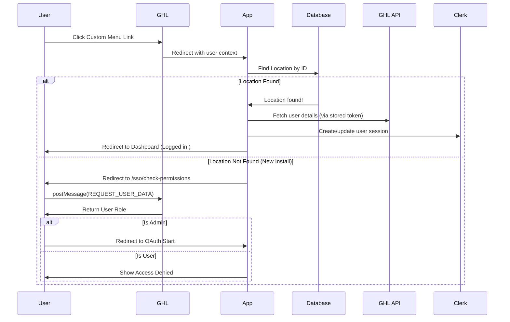

# OAuth + SSO Flow Explained

## First-Time Access (What You're Seeing Now)

When clicking the GHL custom menu link for the **first time**, the app performs a security check:

1.  **Permission Check**: The app verifies if you are an Admin using the GoHighLevel connection.
    -   **Authorized**: You are automatically redirected to the authorization page.
    -   **Access Denied**: If you are not an admin, you will see an "Access Denied" message.
    -   **Fallback**: If the automatic check times out (e.g., due to browser privacy settings), you will see an **"I am an Admin (Continue Setup)"** button.

2.  **Authorize**: If you proceed, you will be asked to grant permissions to the app on `leadconnectorhq.com`.

3.  **Done**: Once authorized, you will see a "Setup Complete" screen. Close the tab and **refresh your original GoHighLevel tab**.

---

## Why You See the Setup Page

The SSO flow checks if your GHL Location exists in the database:

```
1. User clicks custom menu link
2. App looks for Location with ID
3. Location NOT FOUND → Redirect to Permission Check
4. Permission Check Passed → Redirect to OAuth
```

---

## What to Do Next (One-Time Setup)

1.  **Wait for Verification**: The app will try to verify your role automatically.
2.  **If Prompted**: Click **"I am an Admin (Continue Setup)"** if the automatic check fails.
3.  **Authorize**: Log in to `leadconnectorhq.com` (if prompted) and grant permissions.
4.  **Close & Refresh**: Once you see the "Setup Complete" screen, close that tab and **refresh your original GoHighLevel tab**.

**After this one-time setup**:
- ✅ Custom menu link will auto-sign you in
- ✅ No more manual login required
- ✅ SSO works seamlessly

---

## How SSO Works After OAuth Setup



---

## Troubleshooting

### "Access Denied" but I am an Admin?
- The automatic permission check might have timed out.
- Click the **"I am an Admin (Continue Setup)"** button to bypass the check.
- The server will still verify your admin status securely during the next step.

### "Location not found" error repeated?
- You may have denied OAuth permission.
- Try clicking the custom menu link again.
- Ensure you click "Authorize" on the OAuth screen.

### Still showing login page after OAuth?
- Check that the Location was created: Run OAuth flow again.
- Verify `JWT_SECRET` is set in production `.env`.
- Check PM2 logs for errors.
