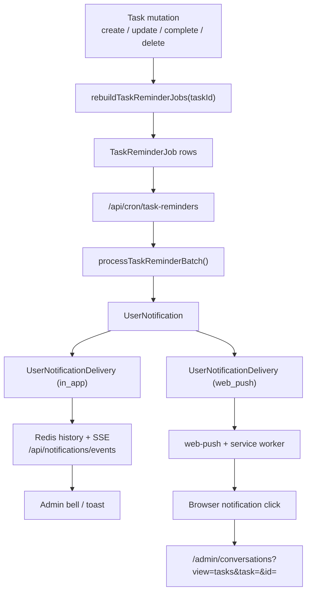

# Task Deadline Reminders & Notifications
**Last Updated:** 2026-03-13

## Overview
This document is the source of truth for task deadline reminders, in-app notifications, browser push subscriptions, and task deep-link behavior.

For the broader task domain, sync-out model, and AI task suggestion flow, see [tasks-implementation-reference.md](/Users/martingreen/Projects/IDX/documentation/tasks-implementation-reference.md).

## Product Scope

### Reminder recipients

- v1 notifies the assigned user only
- there is no creator fallback or admin broadcast path

### Supported channels

- in-app inbox + realtime bell updates
- browser web push

### Scheduling defaults

- default reminder offsets:
  - `1440` minutes (`24 hours before`)
  - `60` minutes (`1 hour before`)
  - `0` minutes (`At due time`)
- optional custom offsets can replace the defaults
- supported offset presets exposed in UI:
  - `4320`, `1440`, `60`, `0`

### Eligibility rules

A task is reminder-eligible only when all of the following are true:

- `status = "open"`
- `deletedAt IS NULL`
- `assignedUserId` is set
- `dueAt` is set
- `reminderMode != "off"`
- the assigned user’s `UserTaskReminderPreference.enabled` is `true`

> [!IMPORTANT]
> `ContactTask.dueAt` stays nullable locally. Provider payload fallbacks do not make the task reminder-eligible unless the local task itself has a due date.

## High-Level Architecture



## Schema

Primary schema lives in [`prisma/schema.prisma`](/Users/martingreen/Projects/IDX/prisma/schema.prisma).

### `ContactTask` reminder fields

```prisma
model ContactTask {
  dueAt           DateTime?
  assignedUserId  String?
  reminderMode    String   @default("default")
  reminderOffsets Json?
}
```

### `TaskReminderJob`

Purpose:

- one durable reminder slot per `taskId + userId + offset slot`
- rebuilt whenever task reminder eligibility changes

Key fields:

- `taskId`
- `userId`
- `locationId`
- `slotKey`
- `offsetMinutes`
- `scheduledFor`
- `status` (`pending`, `processing`, `completed`, `failed`, `dead`, `canceled`)
- retry/lock fields
- `idempotencyKey`

Idempotency:

- key format includes task `syncVersion`
- this lets newer task edits supersede older reminder jobs cleanly

### `UserNotification`

Purpose:

- durable inbox record for the assignee
- created even if browser push is disabled or the user is offline

Key fields:

- `userId`
- `type` (`task_deadline`)
- `title`
- `body`
- `deepLinkUrl`
- `taskId`
- `contactId`
- `conversationId`
- `taskReminderJobId`
- `payload`
- `readAt`
- `clickedAt`

### `UserNotificationDelivery`

Purpose:

- per-channel delivery audit

Channels:

- `in_app`
- `web_push`

Statuses:

- `pending`
- `delivered`
- `failed`
- `disabled`

### `WebPushSubscription`

Purpose:

- stores browser/device subscription endpoints per user

Key fields:

- `endpoint`
- `p256dh`
- `auth`
- `status`
- `deviceLabel`
- `browser`
- `platform`
- `expiration`
- success/failure timestamps and counters

### `UserTaskReminderPreference`

Purpose:

- stores per-user reminder defaults

Key fields:

- `enabled`
- `inAppEnabled`
- `webPushEnabled`
- `defaultOffsets`
- `quietHoursEnabled`
- `quietHoursStartHour`
- `quietHoursEndHour`

## Write Path and Job Rebuilds

Primary file: [`app/(main)/admin/tasks/actions.ts`](/Users/martingreen/Projects/IDX/app/%28main%29/admin/tasks/actions.ts)

### Task mutations that rebuild reminder jobs

- `createContactTask(...)`
- `updateContactTask(...)`
- `setContactTaskCompletion(...)`
- `deleteContactTask(...)`
- `updateCurrentUserTaskReminderPreference(...)`

### Important local behavior

- missing `dueAt` is no longer coerced to “now”
- `assignedUserId` is persisted from task UI and AI-assisted task flows
- `reminderMode` and `reminderOffsets` are stored on the task
- reminder jobs are rebuilt after the local transaction completes

## Scheduling Logic

Primary file: [`lib/tasks/reminders.ts`](/Users/martingreen/Projects/IDX/lib/tasks/reminders.ts)

### Offset expansion

- `default` mode uses the assignee’s `UserTaskReminderPreference.defaultOffsets`
- `custom` mode uses the task’s `reminderOffsets`
- `off` mode creates no reminder jobs

### Quiet hours

- reminder scheduling uses the assignee timezone first
- fallback order:
  - assignee timezone
  - location timezone
  - `UTC`
- pre-due reminders that land inside quiet hours are deferred minute-by-minute until the next allowed minute
- `At due time` reminders stay anchored to the actual due timestamp, even during quiet hours
- if a deferred pre-due reminder would land at or after the due time, it is dropped instead of becoming a late duplicate
- if multiple pre-due offsets collapse onto the same post-quiet-hours minute, only the closest surviving offset is kept

### Supersede and cancel behavior

- if a task changes and `syncVersion` increases, older reminder jobs are considered superseded
- reminder rebuilds mark obsolete rows as `canceled`
- completed/canceled/deleted/unassigned/no-due-date tasks end up with no active reminder jobs

## Cron Processing

Route: [`app/api/cron/task-reminders/route.ts`](/Users/martingreen/Projects/IDX/app/api/cron/task-reminders/route.ts)

- endpoint: `GET /api/cron/task-reminders`
- auth: standard cron authorization via `verifyCronAuthorization(...)`
- overlap/load protection: `CronGuard("task-reminders")`
- feature flag: `TASK_REMINDERS_CRON_ENABLED`
- worker entrypoint: `processTaskReminderBatch({ batchSize: 50 })`
- production scheduler requirement: a system cron must call the route every minute
- canonical server script: [`scripts/cron-task-reminders.sh`](/Users/martingreen/Projects/IDX/scripts/cron-task-reminders.sh)
- install helper: [`scripts/install-cron.sh`](/Users/martingreen/Projects/IDX/scripts/install-cron.sh)

### Retry rules

- max attempts: `6`
- backoff: exponential with jitter
- `404` / `410` push failures mark subscriptions inactive
- retryable push/network failures are rescheduled
- terminal failures become `dead`

## Delivery Channels

### In-app reminders

Files:

- [`lib/tasks/reminders.ts`](/Users/martingreen/Projects/IDX/lib/tasks/reminders.ts)
- [`lib/realtime/notification-events.ts`](/Users/martingreen/Projects/IDX/lib/realtime/notification-events.ts)
- [`app/api/notifications/events/route.ts`](/Users/martingreen/Projects/IDX/app/api/notifications/events/route.ts)

Behavior:

- every processed reminder creates or updates a `UserNotification`
- in-app delivery writes a `UserNotificationDelivery` row with channel `in_app`
- if realtime notifications are enabled, a Redis-backed SSE event is also published
- the admin bell subscribes to `/api/notifications/events` and refreshes its inbox snapshot
- task-deadline notifications are pruned when the related task is deleted, completed, unassigned, rescheduled onto a newer sync version, or otherwise becomes ineligible

### Browser web push

Files:

- [`lib/notifications/push.ts`](/Users/martingreen/Projects/IDX/lib/notifications/push.ts)
- [`app/api/notifications/subscriptions/route.ts`](/Users/martingreen/Projects/IDX/app/api/notifications/subscriptions/route.ts)
- [`public/sw.js`](/Users/martingreen/Projects/IDX/public/sw.js)

Behavior:

- browser permission is requested only from an explicit user action
- the client registers the service worker, subscribes with VAPID, and posts the subscription to `/api/notifications/subscriptions`
- push payloads include:
  - title
  - body
  - task id
  - deep link url
- inactive subscriptions are marked `inactive` on `404` / `410`

## UX Surfaces

### Admin bell / inbox

Files:

- [`components/notifications/admin-notification-bell.tsx`](/Users/martingreen/Projects/IDX/components/notifications/admin-notification-bell.tsx)
- [`app/(main)/admin/_components/dashbord-top-nav.tsx`](/Users/martingreen/Projects/IDX/app/%28main%29/admin/_components/dashbord-top-nav.tsx)

Capabilities:

- unread badge
- recent reminder list
- mark-one / mark-all-as-read
- browser push enable/disable for the current device
- link to the dedicated notification settings page

> [!NOTE]
> The bell is intentionally a quick-action surface. Persistent user-level settings now live under `/admin/settings/notifications`.

### User notification settings page

Files:

- [`app/(main)/admin/settings/notifications/page.tsx`](/Users/martingreen/Projects/IDX/app/%28main%29/admin/settings/notifications/page.tsx)
- [`components/notifications/notification-settings-page.tsx`](/Users/martingreen/Projects/IDX/components/notifications/notification-settings-page.tsx)
- [`components/notifications/notification-preferences-card.tsx`](/Users/martingreen/Projects/IDX/components/notifications/notification-preferences-card.tsx)
- [`components/notifications/notification-current-browser-card.tsx`](/Users/martingreen/Projects/IDX/components/notifications/notification-current-browser-card.tsx)
- [`components/notifications/notification-devices-card.tsx`](/Users/martingreen/Projects/IDX/components/notifications/notification-devices-card.tsx)
- [`components/notifications/use-notification-preferences.ts`](/Users/martingreen/Projects/IDX/components/notifications/use-notification-preferences.ts)

Capabilities:

- persistent per-user reminder preferences
- quiet hours configuration
- default reminder offset selection
- in-app and web push delivery toggles
- current-browser web push enable/disable
- registered-device visibility and revoke actions

### Task editor

File: [`components/tasks/task-editor-dialog.tsx`](/Users/martingreen/Projects/IDX/components/tasks/task-editor-dialog.tsx)

Capabilities:

- shared create/edit dialog
- assignee dropdown populated from `listTaskAssignableUsers()`
- default assignee is the current user on create
- reminder mode selector:
  - `default`
  - `custom`
  - `off`
- custom offset checkboxes
- clear guidance when a task is ineligible for reminders

### Task detail modal

File: [`components/tasks/task-detail-dialog.tsx`](/Users/martingreen/Projects/IDX/components/tasks/task-detail-dialog.tsx)

Shows:

- title, description, priority, status
- due date in the assignee timezone
- assignee
- reminder jobs and delivery status
- provider sync status
- contact summary
- conversation shortcut
- created/updated/completed timestamps

### Mission Control tasks workspace

Files:

- [`app/(main)/admin/conversations/_components/global-task-list.tsx`](/Users/martingreen/Projects/IDX/app/%28main%29/admin/conversations/_components/global-task-list.tsx)
- [`app/(main)/admin/conversations/_components/conversation-interface.tsx`](/Users/martingreen/Projects/IDX/app/%28main%29/admin/conversations/_components/conversation-interface.tsx)

Behavior:

- `view=tasks` keeps the left pane on `GlobalTaskList`
- `task=<taskId>` highlights the task row and opens `TaskDetailDialog`
- `id=<ghlConversationId>` loads the related conversation in the workspace background when present

## Deep Links and Notification Click Behavior

Primary helper: [`lib/tasks/reminder-links.ts`](/Users/martingreen/Projects/IDX/lib/tasks/reminder-links.ts)

Generated URL format:

```text
/admin/conversations?view=tasks&task=<taskId>&id=<ghlConversationId-if-present>
```

### Browser click handling

File: [`public/sw.js`](/Users/martingreen/Projects/IDX/public/sw.js)

- on `notificationclick`, the service worker:
  - closes the browser notification
  - focuses an existing Estio window when possible
  - navigates that window to the reminder deep link
  - falls back to `clients.openWindow(...)` when no existing client is available

### In-app click handling

- clicking a bell item marks the `UserNotification` as read/clicked
- the client navigates to the same deep link used in browser push
- clicking "Manage settings" in the bell routes to `/admin/settings/notifications`

## Feature Flags and Environment Variables

### Feature flags

Defined in [`lib/notifications/feature-flags.ts`](/Users/martingreen/Projects/IDX/lib/notifications/feature-flags.ts):

- `TASK_REMINDERS_UI_ENABLED`
- `TASK_REMINDERS_CRON_ENABLED`
- `NOTIFICATIONS_SSE_ENABLED`
- `WEB_PUSH_ENABLED`
- `NEXT_PUBLIC_TASK_REMINDERS_UI_ENABLED`
- `NEXT_PUBLIC_WEB_PUSH_ENABLED`

### VAPID configuration

Defined in [`lib/notifications/push.ts`](/Users/martingreen/Projects/IDX/lib/notifications/push.ts):

- `NEXT_PUBLIC_WEB_PUSH_VAPID_PUBLIC_KEY`
- `WEB_PUSH_VAPID_PUBLIC_KEY`
- `WEB_PUSH_VAPID_PRIVATE_KEY`
- `WEB_PUSH_VAPID_SUBJECT`

Runtime behavior:

- user-facing notification APIs report `featureFlags.webPush = false` unless `WEB_PUSH_ENABLED` is on and both VAPID keys are present
- when web push is unavailable, the subscriptions API returns an empty public key so the client keeps the browser action disabled instead of failing on subscribe

## AI / Manual Task Creation Implications

Files:

- [`app/(main)/admin/conversations/_components/message-selection-actions.tsx`](/Users/martingreen/Projects/IDX/app/%28main%29/admin/conversations/_components/message-selection-actions.tsx)
- [`app/(main)/admin/conversations/actions.ts`](/Users/martingreen/Projects/IDX/app/%28main%29/admin/conversations/actions.ts)

Rules:

- quick-create from selected text pre-assigns to the current user
- quick-create lets the operator set an optional due date immediately, but does not auto-fill one from the selection
- AI-suggested tasks are also assigned to the acting user when applied
- suggestion rows keep due dates optional, so reminders are not accidentally created from “due now” defaults

## Test and Validation Notes

### Added tests

- [`lib/tasks/reminder-config.test.mjs`](/Users/martingreen/Projects/IDX/lib/tasks/reminder-config.test.mjs)
- [`lib/tasks/reminder-links.test.mjs`](/Users/martingreen/Projects/IDX/lib/tasks/reminder-links.test.mjs)

Command:

```bash
npm run test:tasks:reminders
```

### Operational note

The repo’s Prisma migration chain does not currently generate a clean shadow DB, so this feature was synced to the database with `npx prisma db push` instead of a new checked-in migration file.
