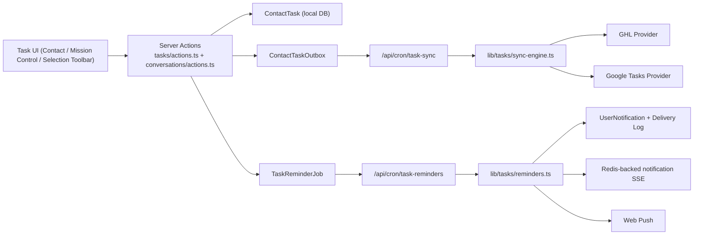

# Tasks Implementation Reference
**Last Updated:** 2026-03-27

## Purpose
This document is the current implementation reference for contact tasks in Estio. It covers:

- local-first task storage and lifecycle
- provider sync-out to GoHighLevel and Google Tasks
- assignment, reminder, and notification entry points
- task UI surfaces across Contacts and Mission Control
- AI task suggestion generate/apply flow

> [!NOTE]
> The dedicated source of truth for the reminder subsystem is [task-deadline-reminders.md](/Users/martingreen/Projects/IDX/documentation/task-deadline-reminders.md). This document keeps only the task-domain context needed to understand where reminders fit.

## Scope Summary

- `ContactTask` remains the local source of truth.
- Every task mutation still enqueues provider sync jobs through the outbox pattern (fire-and-forget; see [Server Actions](#server-actions)).
- Task reminders are now also local-first:
  - reminder jobs are generated from the local task record
  - delivery fan-out is handled from the local database only
  - GHL and Google remain sync targets, not reminder schedulers
- Tasks are visible in:
  - Contact modal
  - Mission Control coordinator panel
  - Mission Control global tasks workspace (`/admin/conversations?view=tasks`)
  - message selection toolbar (manual quick-create + AI suggestions)
- In-app reminder notifications are surfaced from the admin top-nav bell.

## High-Level Architecture

## Data Model

Primary schema lives in [`prisma/schema.prisma`](/Users/martingreen/Projects/IDX/prisma/schema.prisma).

### `ContactTask`

- Local source of truth for tasks.
- Key fields:
  - `locationId`, `contactId`, optional `conversationId`
  - `title`, `description`, `status`, `priority`, nullable `dueAt`, `completedAt`
  - `source` (`manual`, `ai_selection`, `automation`)
  - `assignedUserId`
  - `reminderMode` (`default`, `custom`, `off`)
  - `reminderOffsets` (JSON array of minute offsets when `reminderMode = "custom"`)
  - audit user ids, `deletedAt`, `syncVersion`
- Soft delete behavior:
  - delete sets `deletedAt` and `status = "canceled"`

### `ContactTaskSync`

- Provider sync state per task/provider/account.
- Unique key:
  - `(taskId, provider, providerAccountId)`
- Tracks:
  - remote ids/container ids
  - sync status (`pending`, `synced`, `error`, `disabled`)
  - attempts, errors, timestamps

### `ContactTaskOutbox`

- Durable queue for provider sync operations.
- Stores:
  - `provider` (`ghl`, `google`)
  - `operation` (`create`, `update`, `complete`, `uncomplete`, `delete`)
  - retry and lock state
  - idempotency key `taskId:provider:operation:v{syncVersion}`

### Reminder / notification models

- `TaskReminderJob`
- `UserNotification`
- `UserNotificationDelivery`
- `WebPushSubscription`
- `UserTaskReminderPreference`

Full schema and lifecycle details for these models live in [task-deadline-reminders.md](/Users/martingreen/Projects/IDX/documentation/task-deadline-reminders.md).

## Server Actions

Primary file: [`app/(main)/admin/tasks/actions.ts`](/Users/martingreen/Projects/IDX/app/%28main%29/admin/tasks/actions.ts)

### Auth and scope

- Uses Clerk auth + location context + membership verification.
- All operations are location-scoped.
- Contacts can be resolved by local id or `ghlContactId`.
- Conversations can be resolved by local id or `ghlConversationId`.

### Available actions

- `listContactTasks(contactId, statusFilter)`
  - returns per-contact task list, counts, sync badges, and assignment/reminder metadata used by Contact and Mission Control panels
- `listLocationTasks(statusFilter)`
  - powers the global Mission Control tasks list
- `listTaskAssignableUsers()`
  - returns location members plus the current user id/timezone for assignment UI defaults
- `getTaskDetail(taskId)`
  - returns full task context for the shared detail dialog, including reminder jobs, notification deliveries, provider sync state, contact, and conversation metadata
- `createContactTask(input)`
  - requires `contactId` or `conversationId`
  - keeps `dueAt` nullable when no due date is provided
  - persists `assignedUserId`, `reminderMode`, and optional `reminderOffsets`
  - creates the local task, then fires sync enqueue and reminder rebuild as **fire-and-forget** background work
- `updateContactTask(input)`
  - updates editable fields, increments `syncVersion`, then fires sync enqueue and reminder rebuild as **fire-and-forget**
- `setContactTaskCompletion(taskId, completed)`
  - sets status/completed state, increments `syncVersion`, then fires `complete` or `uncomplete` sync enqueue and reminder rebuild as **fire-and-forget**
- `deleteContactTask(taskId)`
  - soft deletes, marks `canceled`, increments `syncVersion`, then fires `delete` sync enqueue and reminder rebuild as **fire-and-forget**

> [!NOTE]
> **Fire-and-forget pattern (added 2026-03-27):** All four mutation actions return the response to the client immediately after the DB write completes. The `enqueueTaskSyncJobs()` and `rebuildTaskReminderJobs()` calls run as non-blocking `Promise.allSettled()` — errors are caught and logged but never block the HTTP response. The existing cron pollers (`/api/cron/task-sync`, `/api/cron/task-reminders`) pick up the enqueued rows on their next tick. This eliminates 300-700ms of per-operation latency.

## Provider Sync-Out

Primary file: [`lib/tasks/sync-engine.ts`](/Users/martingreen/Projects/IDX/lib/tasks/sync-engine.ts)

### Important reminder-related rule

- Provider payloads may still synthesize a fallback due date when a remote API requires one.
- That fallback is transport-only.
- The local `ContactTask.dueAt` remains nullable and is the only field used for reminder eligibility/scheduling.

### Provider availability

- GHL enabled when location has `ghlAccessToken` and `ghlLocationId`
- Google enabled when the selected sync user has Google credentials
- Google sync user selection order:
  - `assignedUser`
  - `createdByUser`
  - `updatedByUser`

### Queueing and worker behavior

- `enqueueTaskSyncJobs({ taskId, operation, providers?, scheduledAt? })`
- idempotency key includes `syncVersion`
- stale jobs are superseded when their version is older than the task’s current `syncVersion`
- retry/backoff/dead-letter behavior is unchanged from the original outbox design

## Reminder Integration

Reminder scheduling and delivery are implemented in [`lib/tasks/reminders.ts`](/Users/martingreen/Projects/IDX/lib/tasks/reminders.ts).

### Core rules

- reminders are for the assigned user only
- a task only becomes reminder-eligible when all of the following are true:
  - `status = "open"`
  - `deletedAt IS NULL`
  - `assignedUserId` is present
  - `dueAt` is present
  - `reminderMode != "off"`
  - the assigned user’s reminder preferences are enabled
- every task mutation rebuilds its reminder jobs
- reminder job idempotency also includes task `syncVersion`

### Cron

- `/api/cron/task-reminders`
- guarded by `CronGuard`
- processes all due `TaskReminderJob` rows

For the full reminder architecture, delivery flow, feature flags, env vars, and deep-link behavior, see [task-deadline-reminders.md](/Users/martingreen/Projects/IDX/documentation/task-deadline-reminders.md).

## UI Surfaces

### Contact modal tasks tab

File: [`app/(main)/admin/contacts/_components/edit-contact-dialog.tsx`](/Users/martingreen/Projects/IDX/app/%28main%29/admin/contacts/_components/edit-contact-dialog.tsx)

- `Tasks` tab renders `ContactTaskManager`

### Mission Control coordinator panel

File: [`app/(main)/admin/conversations/_components/coordinator-panel.tsx`](/Users/martingreen/Projects/IDX/app/%28main%29/admin/conversations/_components/coordinator-panel.tsx)

- Renders `ContactTaskManager` for the selected conversation contact

### Shared task editor dialog

File: [`components/tasks/task-editor-dialog.tsx`](/Users/martingreen/Projects/IDX/components/tasks/task-editor-dialog.tsx)

- used by both contact-level and Mission Control task surfaces
- supports:
  - assignment to any location member
  - nullable due date
  - reminder mode (`default`, `custom`, `off`)
  - custom reminder offsets
- create mode prefills the assignee to the current user
- reminders only schedule when a due date and assignee are both saved

### Shared task detail dialog

File: [`components/tasks/task-detail-dialog.tsx`](/Users/martingreen/Projects/IDX/components/tasks/task-detail-dialog.tsx)

- shown from the Mission Control tasks workspace
- includes:
  - task metadata
  - assignment
  - reminder schedule and delivery state
  - provider sync status
  - contact and conversation shortcuts
  - quick actions for edit/complete/delete
- uses **per-action loading states** (`completing` / `deleting`) so only the active button shows a spinner

### Mission Control global tasks workspace

Files:

- [`app/(main)/admin/conversations/_components/global-task-list.tsx`](/Users/martingreen/Projects/IDX/app/%28main%29/admin/conversations/_components/global-task-list.tsx)
- [`app/(main)/admin/conversations/_components/conversation-interface.tsx`](/Users/martingreen/Projects/IDX/app/%28main%29/admin/conversations/_components/conversation-interface.tsx)

- Mission Control now supports a dedicated tasks view in the left pane
- URL-driven selection is supported with:
  - `view=tasks`
  - `task=<taskId>`
  - optional `id=<ghlConversationId>`
- selecting a task highlights the row and opens `TaskDetailDialog`
- uses **optimistic UI**: tasks are removed from the list instantly on complete/delete before the server responds; rolled back on failure
- the `estio-tasks-mutated` event listener is **debounced** (300ms) to batch rapid successive events and avoid redundant full refetches

### Admin notification bell

Files:

- [`components/notifications/admin-notification-bell.tsx`](/Users/martingreen/Projects/IDX/components/notifications/admin-notification-bell.tsx)
- [`app/(main)/admin/_components/dashbord-top-nav.tsx`](/Users/martingreen/Projects/IDX/app/%28main%29/admin/_components/dashbord-top-nav.tsx)

- shows unread deadline reminders
- allows mark-read actions
- keeps the popover focused on the reminder inbox
- exposes a compact header link to `/admin/settings/notifications`
- leaves browser push management and delivery preferences to `/admin/settings/notifications`

### User notification settings

Files:

- [`app/(main)/admin/settings/notifications/page.tsx`](/Users/martingreen/Projects/IDX/app/%28main%29/admin/settings/notifications/page.tsx)
- [`components/notifications/notification-settings-page.tsx`](/Users/martingreen/Projects/IDX/components/notifications/notification-settings-page.tsx)

- this is the source of truth for user-level reminder settings
- reuses the existing notification actions, subscription APIs, and reminder preference models
- full reminder UX and delivery behavior is documented in [task-deadline-reminders.md](/Users/martingreen/Projects/IDX/documentation/task-deadline-reminders.md)

## Message Selection Task Actions (AI + manual)

Files:

- [`app/(main)/admin/conversations/_components/message-selection-actions.tsx`](/Users/martingreen/Projects/IDX/app/%28main%29/admin/conversations/_components/message-selection-actions.tsx)
- [`app/(main)/admin/conversations/actions.ts`](/Users/martingreen/Projects/IDX/app/%28main%29/admin/conversations/actions.ts)

### Manual quick-create from selection

- pre-fills title/notes from the selected text
- pre-assigns the task to the current user
- lets the operator optionally set a due date at creation time
- if the due date is left blank, reminders still start only after a due date is added later

### AI suggestions

- still generate/edit/apply multiple candidate tasks
- selected suggestions are created through `createContactTask(...)`
- applied suggestions now default assignment to the acting user
- suggestion edit rows no longer default `dueAt` to “now”

## AI Task Suggestions and Telemetry

Primary file: [`app/(main)/admin/conversations/actions.ts`](/Users/martingreen/Projects/IDX/app/%28main%29/admin/conversations/actions.ts)

### Generation

- `suggestTasksFromSelection(conversationId, selectedText, modelOverride?)`
- uses the LLM in JSON mode
- normalizes priority, due date, and confidence
- deduplicates titles and caps output size

### Apply

- `applySuggestedTasksFromSelection(conversationId, suggestions[])`
- creates tasks by calling `createContactTask(...)`
- emits task suggestion funnel telemetry

### Telemetry event families

- `task_suggestion.generate.requested`
- `task_suggestion.generate.succeeded`
- `task_suggestion.generate.failed`
- `task_suggestion.apply.requested`
- `task_suggestion.apply.completed`
- `task_suggestion.apply.failed`

## Google Task List Settings

File: [`app/(main)/admin/settings/integrations/google/tasklist-settings.tsx`](/Users/martingreen/Projects/IDX/app/%28main%29/admin/settings/integrations/google/tasklist-settings.tsx)

- loads available Google tasklists for the connected user
- saves preferred tasklist id/title to the local user record
- new Google sync-outs use the selected list
- existing already-synced tasks remain on their recorded provider container

## Main Files to Touch

### Schema

- [`prisma/schema.prisma`](/Users/martingreen/Projects/IDX/prisma/schema.prisma)

### Core task domain logic

- [`app/(main)/admin/tasks/actions.ts`](/Users/martingreen/Projects/IDX/app/%28main%29/admin/tasks/actions.ts)
- [`lib/tasks/sync-engine.ts`](/Users/martingreen/Projects/IDX/lib/tasks/sync-engine.ts)
- [`lib/tasks/providers/ghl.ts`](/Users/martingreen/Projects/IDX/lib/tasks/providers/ghl.ts)
- [`lib/tasks/providers/google.ts`](/Users/martingreen/Projects/IDX/lib/tasks/providers/google.ts)

### Reminder subsystem

- [`lib/tasks/reminders.ts`](/Users/martingreen/Projects/IDX/lib/tasks/reminders.ts)
- [`lib/tasks/reminder-config.ts`](/Users/martingreen/Projects/IDX/lib/tasks/reminder-config.ts)
- [`lib/tasks/reminder-links.ts`](/Users/martingreen/Projects/IDX/lib/tasks/reminder-links.ts)
- [`app/api/cron/task-reminders/route.ts`](/Users/martingreen/Projects/IDX/app/api/cron/task-reminders/route.ts)
- [`app/api/notifications/events/route.ts`](/Users/martingreen/Projects/IDX/app/api/notifications/events/route.ts)
- [`app/api/notifications/subscriptions/route.ts`](/Users/martingreen/Projects/IDX/app/api/notifications/subscriptions/route.ts)

### UI

- [`components/tasks/contact-task-manager.tsx`](/Users/martingreen/Projects/IDX/components/tasks/contact-task-manager.tsx)
- [`components/tasks/task-editor-dialog.tsx`](/Users/martingreen/Projects/IDX/components/tasks/task-editor-dialog.tsx)
- [`components/tasks/task-detail-dialog.tsx`](/Users/martingreen/Projects/IDX/components/tasks/task-detail-dialog.tsx)
- [`app/(main)/admin/conversations/_components/global-task-list.tsx`](/Users/martingreen/Projects/IDX/app/%28main%29/admin/conversations/_components/global-task-list.tsx)
- [`components/notifications/admin-notification-bell.tsx`](/Users/martingreen/Projects/IDX/components/notifications/admin-notification-bell.tsx)

## Current Limitations

- Sync is still outbound only. Inbound reconciliation from GHL/Google into local tasks is not implemented.
- Reminder channels in this implementation are limited to:
  - in-app inbox/realtime
  - browser web push
- Browser push requires VAPID keys, a supported browser, and an explicit user opt-in from the bell/settings UI.
