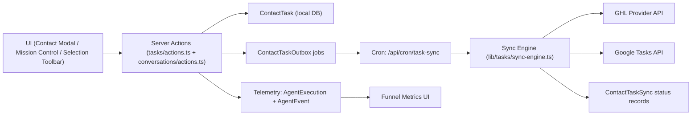

# Tasks Implementation Reference

## Purpose
This document is the current implementation reference for contact tasks in Estio. It covers:

- Core task schema and relationships
- Local task lifecycle (create/update/complete/delete)
- Sync-out architecture to GoHighLevel and Google Tasks
- Task UI surfaces in Mission Control and Contact modal
- AI task suggestion generate/apply flow and telemetry
- Main files to touch for future changes

This reflects the codebase state at commit `fd0cee5` (March 1, 2026).

## Scope Summary

- Tasks are stored locally first (`ContactTask`).
- Every mutation enqueues provider sync jobs (outbox pattern).
- Sync-out currently targets:
  - GoHighLevel contact tasks
  - Google Tasks (per-user selected task list)
- Tasks are visible in:
  - Mission Control coordinator panel
  - Contact modal (`Tasks` tab)
  - Message selection toolbar (AI suggestions + apply)
- Suggestion funnel telemetry is stored and visualized.

## High-Level Architecture

## Data Model

Primary schema lives in [`prisma/schema.prisma`](/Users/martingreen/Projects/IDX/prisma/schema.prisma).

### `ContactTask`

- Local source of truth for tasks
- Key fields:
  - `locationId`, `contactId`, optional `conversationId`
  - `title`, `description`, `status`, `priority`, `dueAt`, `completedAt`
  - `source` (`manual`, `ai_selection`, `automation`)
  - `assignedUserId`, audit user ids, `deletedAt`
  - `syncVersion` (used in outbox idempotency/supersede logic)
- Soft delete behavior:
  - Delete sets `deletedAt` and `status = "canceled"`

### `ContactTaskSync`

- Provider sync state per task/provider/account
- Unique key:
  - `(taskId, provider, providerAccountId)`
- Tracks:
  - `providerTaskId`, `providerContainerId`
  - `status` (`pending`, `synced`, `error`, `disabled`)
  - attempts, last error, last sync metadata

### `ContactTaskOutbox`

- Durable queue for sync operations
- Stores:
  - `provider` (`ghl`, `google`)
  - `operation` (`create`, `update`, `complete`, `uncomplete`, `delete`)
  - retry/lock scheduling state
  - unique `idempotencyKey` (`taskId:provider:operation:v{syncVersion}`)

### Related `User` fields for Google Tasks

- `googleTasklistId`
- `googleTasklistTitle`
- plus OAuth tokens used by Google provider

### Telemetry tables used by task suggestions

- `AgentExecution` for model execution traces (prompt/usage/latency/cost)
- `AgentEvent` for funnel events and metrics aggregation

## Server Actions: Local Task Lifecycle

Primary file: [`app/(main)/admin/tasks/actions.ts`](/Users/martingreen/Projects/IDX/app/%28main%29/admin/tasks/actions.ts)

### Auth and scope

- Uses Clerk auth + location context + membership verification
- All operations are location-scoped
- Contact can be resolved by local id or `ghlContactId`
- Conversation can be resolved by local id or `ghlConversationId`

### Available actions

- `listContactTasks(contactId, statusFilter)`
  - Filters open/completed/all
  - Returns counts and includes sync/outbox status for badges
- `createContactTask(input)`
  - Requires `contactId` or `conversationId`
  - Creates local task, then enqueues sync jobs
- `updateContactTask(input)`
  - Updates editable fields, increments `syncVersion`, enqueues `update`
- `setContactTaskCompletion(taskId, completed)`
  - Sets status/completedAt, increments `syncVersion`, enqueues `complete` or `uncomplete`
- `deleteContactTask(taskId)`
  - Soft deletes (`deletedAt`), sets `canceled`, increments `syncVersion`, enqueues `delete`

## Sync Engine and Outbox Processing

Primary file: [`lib/tasks/sync-engine.ts`](/Users/martingreen/Projects/IDX/lib/tasks/sync-engine.ts)

### Provider availability

- GHL enabled when location has `ghlAccessToken` and `ghlLocationId`
- Google enabled when selected sync user has Google credentials
- Google sync user selection order:
  - `assignedUser` -> `createdByUser` -> `updatedByUser`

### Queueing

- `enqueueTaskSyncJobs({ taskId, operation, providers?, scheduledAt? })`
- Generates idempotency key with current `syncVersion`
- Duplicate key collisions are treated as intentional idempotency
- Keeps `ContactTaskSync` in `pending` while queued/requeued

### Worker execution

- `processTaskSyncOutboxBatch({ batchSize, workerId })`
- Recovers stale processing locks older than 5 minutes
- Claims pending/failed due jobs via atomic `updateMany` status transition
- Calls `processSingleOutboxJob(...)`

### Retry and dead-letter behavior

- Max attempts: `6`
- Backoff: exponential with jitter (up to 30 minutes)
- Retryable:
  - network/unknown errors
  - HTTP `408`, `409`, `425`, `429`, `5xx`
- Non-retryable:
  - GHL `400`, `401`, `403`, `404`, `422`
  - general `4xx` (except retryable list above)
- Terminal outcomes:
  - `completed` on success
  - `failed` when retrying
  - `dead` when non-retryable or max attempts reached

### Supersede logic

- Outbox key includes `v{syncVersion}`
- If a job’s version is older than current task `syncVersion`, it is marked completed as superseded and skipped

## Provider Implementations

### GoHighLevel provider

File: [`lib/tasks/providers/ghl.ts`](/Users/martingreen/Projects/IDX/lib/tasks/providers/ghl.ts)

- Create: `POST /contacts/{ghlContactId}/tasks`
- Update: `PUT /contacts/{ghlContactId}/tasks/{providerTaskId}`
- Complete toggle:
  - Preferred endpoint: `PUT .../completed`
  - Fallback: `PUT .../tasks/{id}` with `completed`
- Delete: `DELETE /contacts/{ghlContactId}/tasks/{providerTaskId}`
- Notable behavior:
  - If task contact is not linked yet, sync engine calls `ensureRemoteContact(...)`
  - For GHL payload, `dueDate` is always provided (defaults to now if missing)

### Google Tasks provider

File: [`lib/tasks/providers/google.ts`](/Users/martingreen/Projects/IDX/lib/tasks/providers/google.ts)

- Uses Google Tasks API via `googleapis`
- Supports listing tasklists for settings UI
- Default list id: `@default`
- Operations:
  - Create: `tasks.insert`
  - Update: `tasks.update`
  - Complete toggle: `tasks.patch`
  - Delete: `tasks.delete`
- Stores and reuses `providerContainerId` (tasklist id) so existing remote tasks remain on their original list

## Scheduled Execution

Cron endpoint: [`app/api/cron/task-sync/route.ts`](/Users/martingreen/Projects/IDX/app/api/cron/task-sync/route.ts)

- `GET /api/cron/task-sync`
- Optional bearer secret check via `CRON_SECRET`
- Uses `CronGuard` lock/resource checks to avoid overlap and high-load runs
- Processes batch with `processTaskSyncOutboxBatch({ batchSize: 25 })`

## UI Surfaces

### Contact modal tasks tab

File: [`app/(main)/admin/contacts/_components/edit-contact-dialog.tsx`](/Users/martingreen/Projects/IDX/app/%28main%29/admin/contacts/_components/edit-contact-dialog.tsx)

- `Tasks` tab renders `ContactTaskManager` for the contact

### Mission Control side panel tasks

File: [`app/(main)/admin/conversations/_components/coordinator-panel.tsx`](/Users/martingreen/Projects/IDX/app/%28main%29/admin/conversations/_components/coordinator-panel.tsx)

- Renders `ContactTaskManager` in coordinator panel for current conversation contact

### Shared task manager component

File: [`components/tasks/contact-task-manager.tsx`](/Users/martingreen/Projects/IDX/components/tasks/contact-task-manager.tsx)

- Supports compact mode and title customization
- Features:
  - optimistic create/complete/delete
  - filters: open/done/all with counts
  - add-task modal with title/description/due datetime
  - provider sync badges (GHL/Google)
  - retry/dead/processing/pending/synced UI states

### Message selection task actions (AI + manual)

File: [`app/(main)/admin/conversations/_components/message-selection-actions.tsx`](/Users/martingreen/Projects/IDX/app/%28main%29/admin/conversations/_components/message-selection-actions.tsx)

- Selection toolbar actions include:
  - `Task` (single manual task from selection)
  - `Suggest` (AI-generated task suggestions)
- Suggest flow:
  - generate suggestions
  - edit title/notes/priority/due
  - select subset
  - apply selected tasks to contact
- Supports batch context from multiple selected snippets

## AI Task Suggestions and Telemetry

Primary file: [`app/(main)/admin/conversations/actions.ts`](/Users/martingreen/Projects/IDX/app/%28main%29/admin/conversations/actions.ts)

### Generation

- `suggestTasksFromSelection(conversationId, selectedText, modelOverride?)`
- Uses LLM in JSON mode
- Enforces schema and normalization:
  - max 6 suggestions
  - normalized priority/dueAt/confidence
  - title de-duplication

### Apply

- `applySuggestedTasksFromSelection(conversationId, suggestions[])`
- Server-side validation + normalization
- Creates tasks by calling `createContactTask(...)` internally
- Returns created/failed counts and details

### Execution telemetry

- Generation traces persisted in `AgentExecution` via `persistSelectionAiExecution(...)`
- Includes prompt, normalized output, token usage, latency, estimated cost

### Funnel telemetry

- Persisted in `AgentEvent`:
  - `task_suggestion.generate.requested`
  - `task_suggestion.generate.succeeded`
  - `task_suggestion.generate.failed`
  - `task_suggestion.apply.requested`
  - `task_suggestion.apply.completed`
  - `task_suggestion.apply.failed`
- Aggregation API:
  - `getTaskSuggestionFunnelMetrics(...)`
  - supports `location` or `conversation` scope and window days

### Metrics UI

File: [`app/(main)/admin/conversations/_components/task-suggestion-funnel-metrics.tsx`](/Users/martingreen/Projects/IDX/app/%28main%29/admin/conversations/_components/task-suggestion-funnel-metrics.tsx)

- Embedded in Suggest dialog
- Shows:
  - request/success/apply/task-created totals
  - conversion rates and averages
  - daily trend
  - top failures

## Google Tasks List Settings (Per User)

Settings page files:

- [`app/(main)/admin/settings/integrations/google/page.tsx`](/Users/martingreen/Projects/IDX/app/%28main%29/admin/settings/integrations/google/page.tsx)
- [`app/(main)/admin/settings/integrations/google/tasklist-settings.tsx`](/Users/martingreen/Projects/IDX/app/%28main%29/admin/settings/integrations/google/tasklist-settings.tsx)
- [`app/(main)/admin/settings/integrations/google/actions.ts`](/Users/martingreen/Projects/IDX/app/%28main%29/admin/settings/integrations/google/actions.ts)

Behavior:

- Loads available Google tasklists for connected user
- Saves preferred tasklist id/title to user record
- New Google task sync-outs use selected list
- Existing already-synced tasks remain on their recorded provider container

## File Map

Core schema and types:

- [`prisma/schema.prisma`](/Users/martingreen/Projects/IDX/prisma/schema.prisma): Task models, user tasklist fields, telemetry model
- [`lib/tasks/types.ts`](/Users/martingreen/Projects/IDX/lib/tasks/types.ts): provider/operation/status type constants

Core task domain logic:

- [`app/(main)/admin/tasks/actions.ts`](/Users/martingreen/Projects/IDX/app/%28main%29/admin/tasks/actions.ts): task CRUD server actions
- [`lib/tasks/sync-engine.ts`](/Users/martingreen/Projects/IDX/lib/tasks/sync-engine.ts): outbox queue + retry + provider dispatch
- [`lib/tasks/providers/ghl.ts`](/Users/martingreen/Projects/IDX/lib/tasks/providers/ghl.ts): GHL API adapter
- [`lib/tasks/providers/google.ts`](/Users/martingreen/Projects/IDX/lib/tasks/providers/google.ts): Google Tasks API adapter

Scheduling and operational endpoint:

- [`app/api/cron/task-sync/route.ts`](/Users/martingreen/Projects/IDX/app/api/cron/task-sync/route.ts): outbox worker trigger endpoint

UI:

- [`components/tasks/contact-task-manager.tsx`](/Users/martingreen/Projects/IDX/components/tasks/contact-task-manager.tsx): reusable task UI + sync badges
- [`app/(main)/admin/conversations/_components/coordinator-panel.tsx`](/Users/martingreen/Projects/IDX/app/%28main%29/admin/conversations/_components/coordinator-panel.tsx): Mission Control tasks block
- [`app/(main)/admin/contacts/_components/edit-contact-dialog.tsx`](/Users/martingreen/Projects/IDX/app/%28main%29/admin/contacts/_components/edit-contact-dialog.tsx): Contact modal tasks tab
- [`app/(main)/admin/conversations/_components/message-selection-actions.tsx`](/Users/martingreen/Projects/IDX/app/%28main%29/admin/conversations/_components/message-selection-actions.tsx): suggest/apply UI from conversation selection
- [`app/(main)/admin/conversations/_components/task-suggestion-funnel-metrics.tsx`](/Users/martingreen/Projects/IDX/app/%28main%29/admin/conversations/_components/task-suggestion-funnel-metrics.tsx): funnel analytics card

Suggestion + telemetry backend:

- [`app/(main)/admin/conversations/actions.ts`](/Users/martingreen/Projects/IDX/app/%28main%29/admin/conversations/actions.ts): suggestion generation, apply action, funnel metrics query

Google tasklist settings:

- [`app/(main)/admin/settings/integrations/google/page.tsx`](/Users/martingreen/Projects/IDX/app/%28main%29/admin/settings/integrations/google/page.tsx)
- [`app/(main)/admin/settings/integrations/google/tasklist-settings.tsx`](/Users/martingreen/Projects/IDX/app/%28main%29/admin/settings/integrations/google/tasklist-settings.tsx)
- [`app/(main)/admin/settings/integrations/google/actions.ts`](/Users/martingreen/Projects/IDX/app/%28main%29/admin/settings/integrations/google/actions.ts)

## Current Constraints and Notes

- This is sync-out only. Inbound task sync from GHL/Google to local tasks is not implemented.
- `providerAccountId` is currently hardcoded to `"default"` in sync records.
- Suggestion metrics use `AgentEvent.processedAt` event time, not wall-clock UI time.
- `getTaskSuggestionFunnelMetrics(...)` is location-scoped and uses existing conversation resolution rules.
- Deletion is soft-delete locally plus remote delete sync attempt.

## Recommended Future Extension Points

- Add inbound reconciliation workers for provider-originated task changes.
- Support per-provider account ids beyond `"default"` for multi-account workflows.
- Add manual retry action in UI for `dead` jobs (server action for targeted requeue).
- Add assignment UI in task manager (`assignedUserId` exists in schema/actions).
- Add stronger provider capability detection and richer error categorization.
